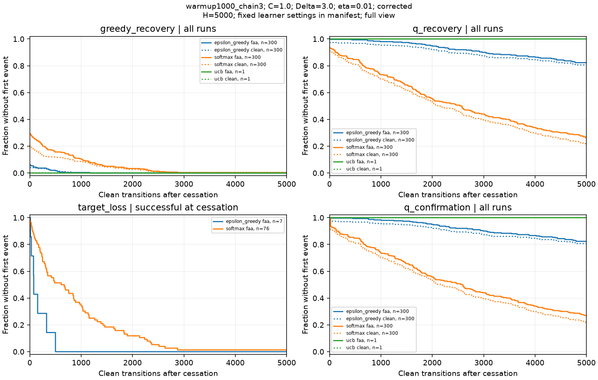
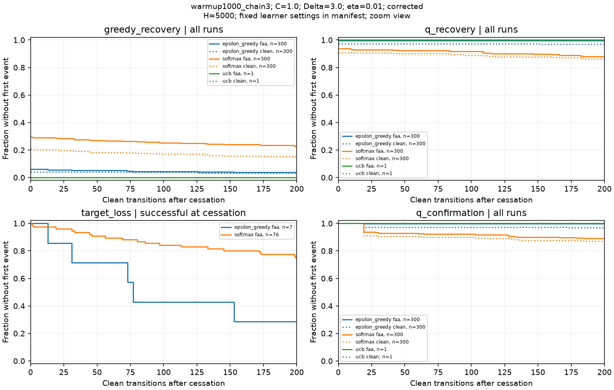
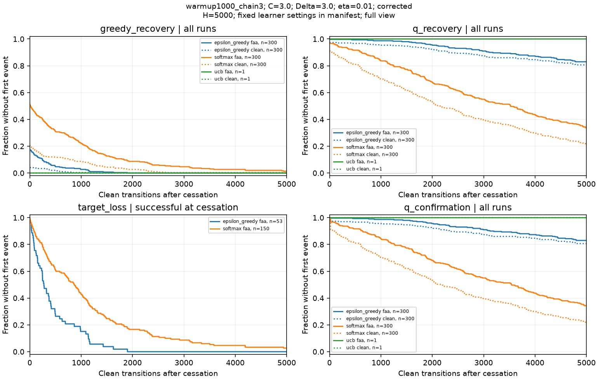
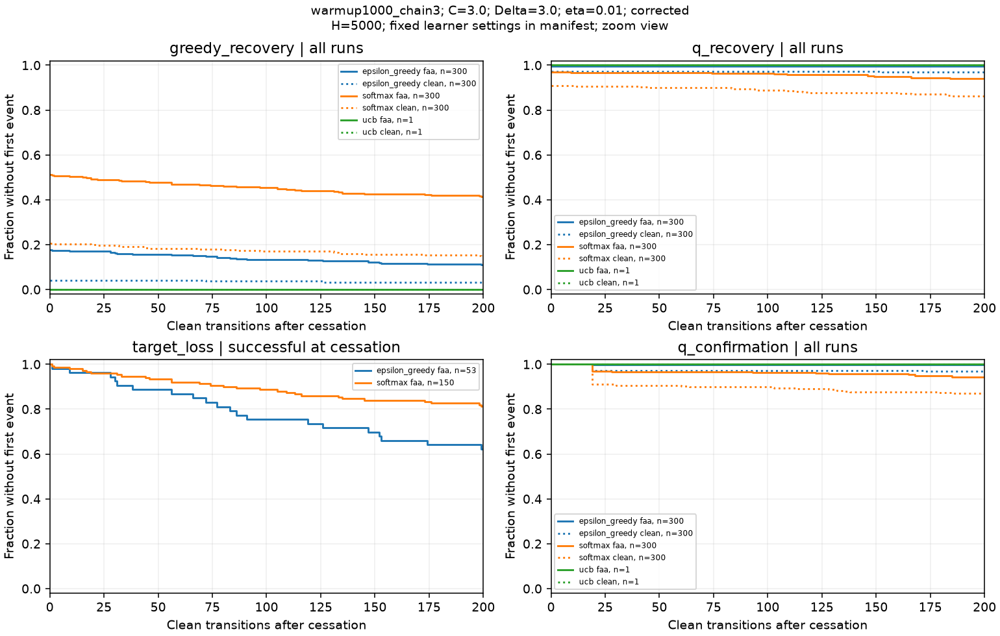
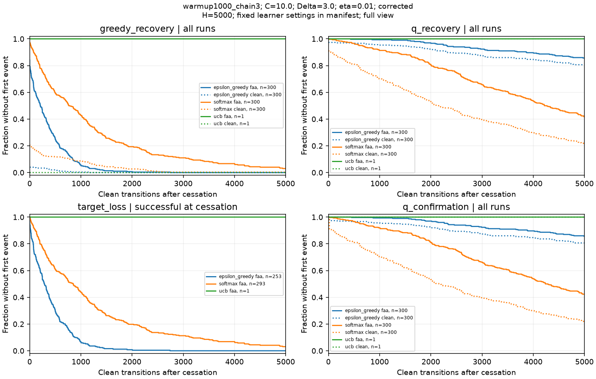
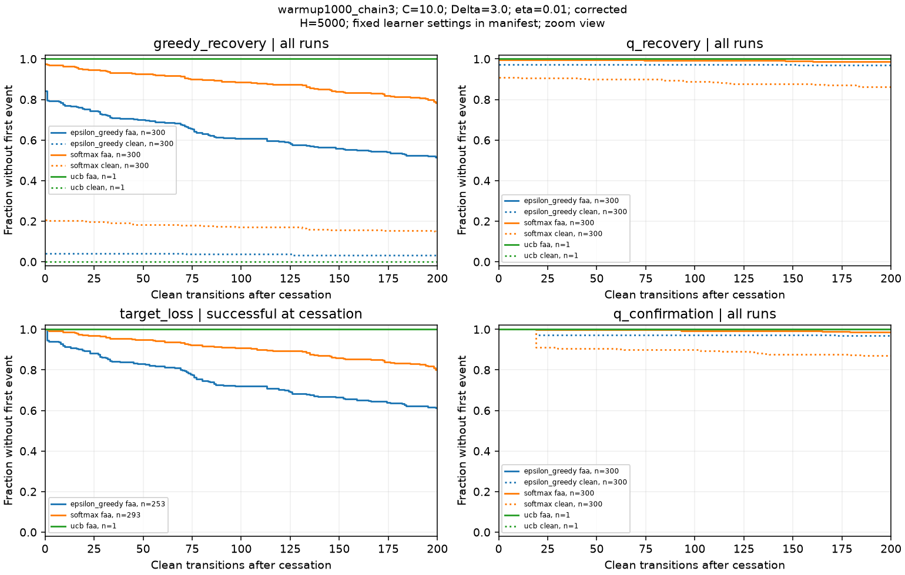
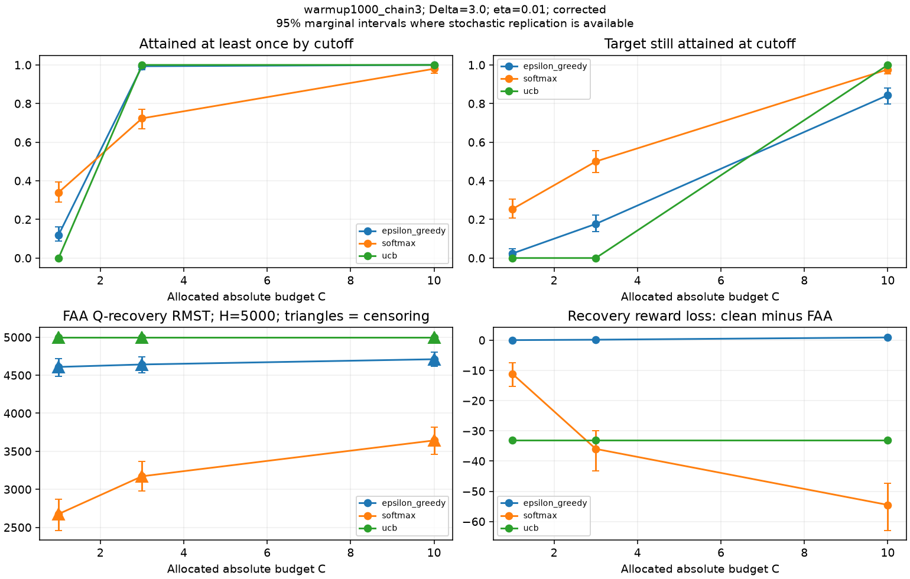
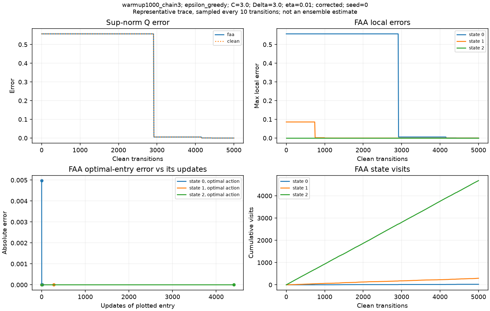
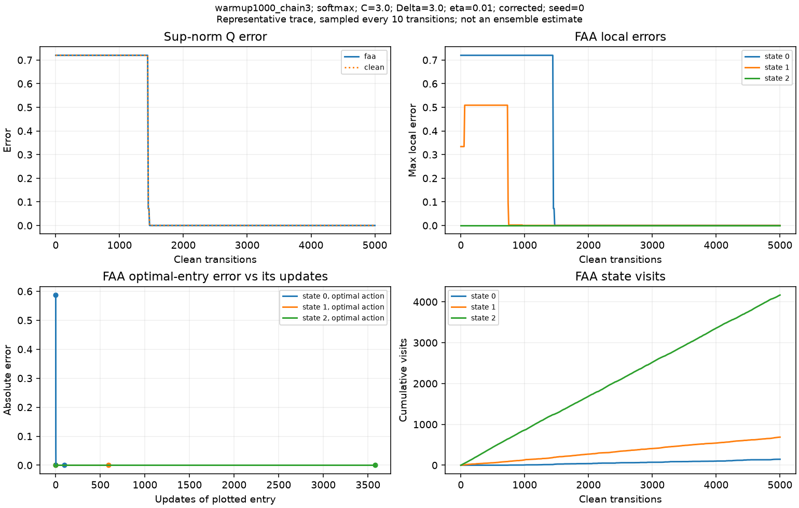
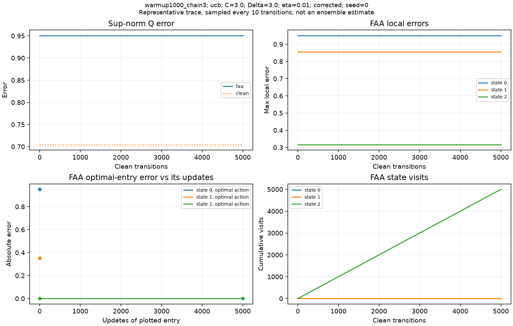

# Multi-state FAA experiment report

Completed paired jobs: **1803/1803**. Complete.

## What was run

Warmup or controlled initialization → 500 attack transitions → 5000 clean transitions. Each pair runs to the full horizon. FAA uses the documented demotion convention and both caps. This is a reconstruction/transfer study, not a literal reproduction of the source paper.

Common learner settings: `{"alpha": 0.9, "alpha_schedule": "constant", "beta": 1.0, "epsilon": 0.1, "temperature": 0.2}`. Gamma=0.9; accuracy tolerance=0.05; confirmation=20 observations. Ties select the lowest action index. UCB uses local state counts. Fixed navigation settings: `{"navigation_epsilon": 0.1, "ranking_tolerance": 1e-10}`.

Complete environments, initializations, targets, signs, seeds and simulation code hashes: [manifest.json](manifest.json). Analysis parameters and source hash: [analysis_settings.json](analysis_settings.json).

## Primary results

Q recovery uses all runs. Target-loss persistence is conditional on success at cessation; its sample size can differ between learners. RMST is E[min(T,H)], not an estimate of an uncensored mean when censoring occurs.

| Design | Rule | C / Delta / eta / sign | n | Ever attained | At cutoff | Actual spend | Q RMST | Q censored | Conditional target-loss n / RMST | Recovery reward loss |
| --- | --- | --- | ---: | ---: | ---: | ---: | ---: | ---: | --- | ---: |
| warmup1000_chain3 | epsilon_greedy | 1.0 / 3.0 / 0.01 / corrected | 300 | 0.12 | 0.02333 | 1 | 4609 | 247 | 7 / 167.7 | 0.02567 |
| warmup1000_chain3 | softmax | 1.0 / 3.0 / 0.01 / corrected | 300 | 0.34 | 0.2533 | 0.8319 | 2676 | 79 | 76 / 864.3 | -11.13 |
| warmup1000_chain3 | ucb | 1.0 / 3.0 / 0.01 / corrected | 1 | 0 | 0 | 1 | 5000 | 1 | 0 / — | -33 |
| warmup1000_chain3 | epsilon_greedy | 3.0 / 3.0 / 0.01 / corrected | 300 | 0.9933 | 0.1767 | 2.916 | 4642 | 249 | 53 / 446.2 | 0.1577 |
| warmup1000_chain3 | softmax | 3.0 / 3.0 / 0.01 / corrected | 300 | 0.7233 | 0.5 | 2.251 | 3172 | 101 | 150 / 1143 | -35.98 |
| warmup1000_chain3 | ucb | 3.0 / 3.0 / 0.01 / corrected | 1 | 1 | 0 | 3 | 5000 | 1 | 0 / — | -33 |
| warmup1000_chain3 | epsilon_greedy | 10.0 / 3.0 / 0.01 / corrected | 300 | 1 | 0.8433 | 6.146 | 4710 | 257 | 253 / 392.7 | 0.902 |
| warmup1000_chain3 | softmax | 10.0 / 3.0 / 0.01 / corrected | 300 | 0.98 | 0.9767 | 3.44 | 3643 | 125 | 293 / 1219 | -54.51 |
| warmup1000_chain3 | ucb | 10.0 / 3.0 / 0.01 / corrected | 1 | 1 | 1 | 3.702 | 5000 | 1 | 1 / 5000 | -33 |

## Clean-baseline diagnostic

Whole-table accuracy may remain poor even without poisoning. Read the clean baseline alongside the FAA result; a censored Q-recovery time alone does not identify attack-induced delay. Repeated clean results across budgets use the same seeds and are not independent replications.

| Design | Rule | C | n | Clean Q RMST | Clean Q censored | Initial Q-error mean |
| --- | --- | ---: | ---: | ---: | ---: | ---: |
| warmup1000_chain3 | epsilon_greedy | 1.0 | 300 | 4488 | 242 | 0.6442 |
| warmup1000_chain3 | softmax | 10.0 | 300 | 2488 | 64 | 0.6507 |
| warmup1000_chain3 | softmax | 1.0 | 300 | 2488 | 64 | 0.6507 |
| warmup1000_chain3 | epsilon_greedy | 3.0 | 300 | 4488 | 242 | 0.6442 |
| warmup1000_chain3 | ucb | 3.0 | 1 | 5000 | 1 | 0.7044 |
| warmup1000_chain3 | ucb | 1.0 | 1 | 5000 | 1 | 0.7044 |
| warmup1000_chain3 | softmax | 3.0 | 300 | 2488 | 64 | 0.6507 |
| warmup1000_chain3 | ucb | 10.0 | 1 | 5000 | 1 | 0.7044 |
| warmup1000_chain3 | epsilon_greedy | 10.0 | 300 | 4488 | 242 | 0.6442 |

## Measurement files

- [summary.csv](summary.csv): attainment and all recovery endpoints, both arms, cohort sizes, censoring, quartiles, restricted means and bootstrap intervals.
- [conditions.csv](conditions.csv): attainment proportions and Wilson intervals; clipping rates; actual spend and its purpose; initial Q error.
- [paired_differences.csv](paired_differences.csv): paired reward/goal loss and recovery-delay differences with bootstrap intervals.
- [runs.csv](runs.csv): per-run endpoints, recurrence, occupancy, error, sweeps, and full-horizon reward/goal totals.
- [coverage.csv](coverage.csv): state/action first visits, inherited counts, entry errors, and update totals. Altered-entry flags refer to the FAA arm for both paired arms.
- [survival.csv](survival.csv): exact empirical staircase at event times; marginal Wilson intervals. Hold each value constant until the next event time.
- Raw compressed records in the input folder retain Q/count snapshots, complete sweep endpoints, and every FAA request/applied perturbation. Keep them for reproducibility.

## Interpretation limits

These outputs separate attainment from persistence and task damage. Failure to attain is not robust recovery from a successful attack. Longer waiting or Q-error delay is not automatically larger reward loss. Real warmup changes values and count imbalance; controlled initialization isolates designated factors. No universal ranking or general multi-state UCB convergence theorem follows from these plots.

Intervals are marginal 95% intervals, not simultaneous guarantees. Identical deterministic UCB runs are collapsed to one; no sampling intervals are shown for those conditions. Shared seeds across budgets/designs induce dependence. Conditional target-loss samples can be small and selectively different. Blank values mean unavailable, not zero.

## Figures

### warmup1000_chain3: C=1.0, full

All-run policy/value recovery; target-loss curves include only FAA runs successful at cessation. Curves show first events, not current correctness. No uncertainty bands are drawn; pointwise intervals are in survival.csv.

### warmup1000_chain3: C=1.0, zoom

All-run policy/value recovery; target-loss curves include only FAA runs successful at cessation. Curves show first events, not current correctness. No uncertainty bands are drawn; pointwise intervals are in survival.csv.

### warmup1000_chain3: C=3.0, full

All-run policy/value recovery; target-loss curves include only FAA runs successful at cessation. Curves show first events, not current correctness. No uncertainty bands are drawn; pointwise intervals are in survival.csv.

### warmup1000_chain3: C=3.0, zoom

All-run policy/value recovery; target-loss curves include only FAA runs successful at cessation. Curves show first events, not current correctness. No uncertainty bands are drawn; pointwise intervals are in survival.csv.

### warmup1000_chain3: C=10.0, full

All-run policy/value recovery; target-loss curves include only FAA runs successful at cessation. Curves show first events, not current correctness. No uncertainty bands are drawn; pointwise intervals are in survival.csv.

### warmup1000_chain3: C=10.0, zoom

All-run policy/value recovery; target-loss curves include only FAA runs successful at cessation. Curves show first events, not current correctness. No uncertainty bands are drawn; pointwise intervals are in survival.csv.

### Budget comparison: warmup1000_chain3

Allocated budget is the controlled setting. Actual spend is reported separately. Positive reward loss means the attacked arm earned less. UCB deterministic points have no sampling interval.

### Mechanism trace: warmup1000_chain3, epsilon_greedy

A prespecified representative run, not evidence of a typical trajectory. Error versus entry updates also reflects intervening downstream changes. Complete sweep endpoints remain in raw records.

### Mechanism trace: warmup1000_chain3, softmax

A prespecified representative run, not evidence of a typical trajectory. Error versus entry updates also reflects intervening downstream changes. Complete sweep endpoints remain in raw records.

### Mechanism trace: warmup1000_chain3, ucb

A prespecified representative run, not evidence of a typical trajectory. Error versus entry updates also reflects intervening downstream changes. Complete sweep endpoints remain in raw records.

