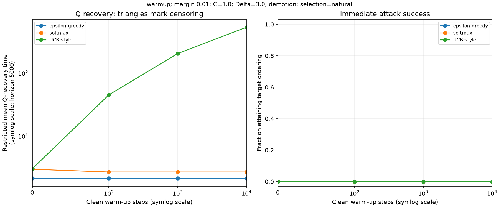
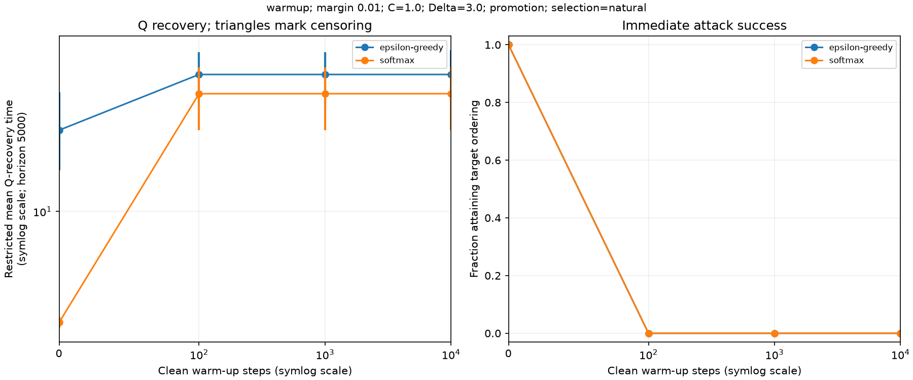
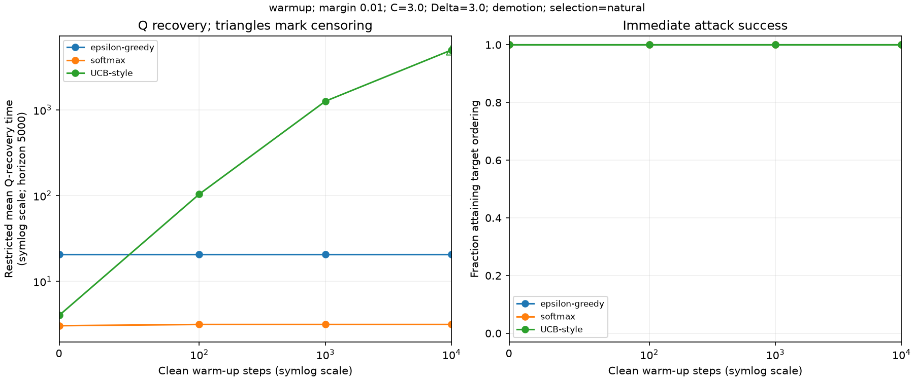
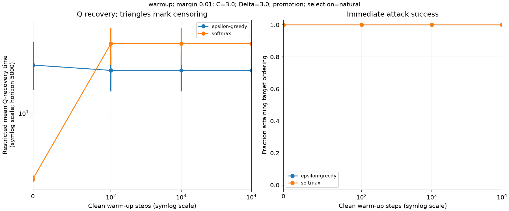
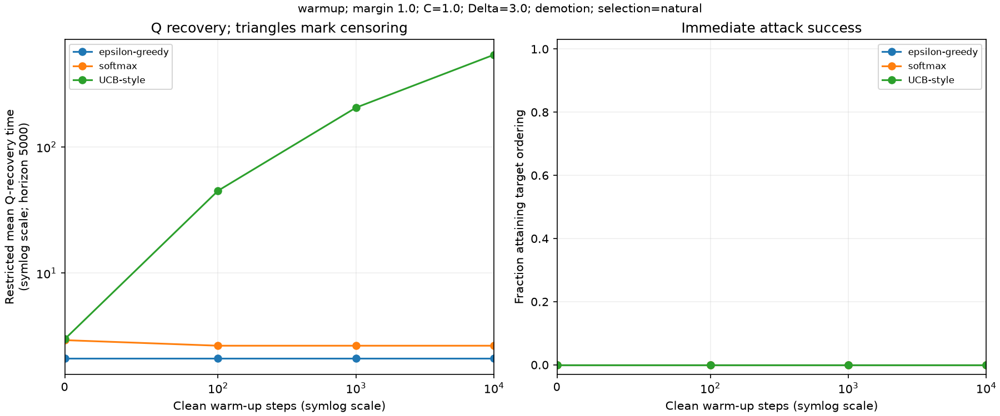
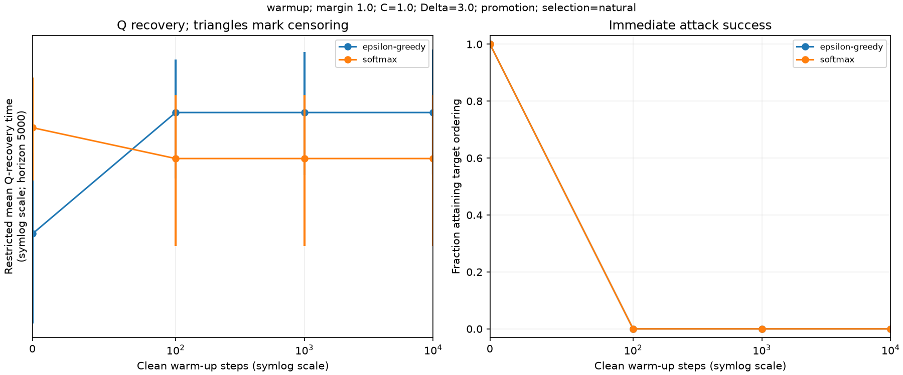
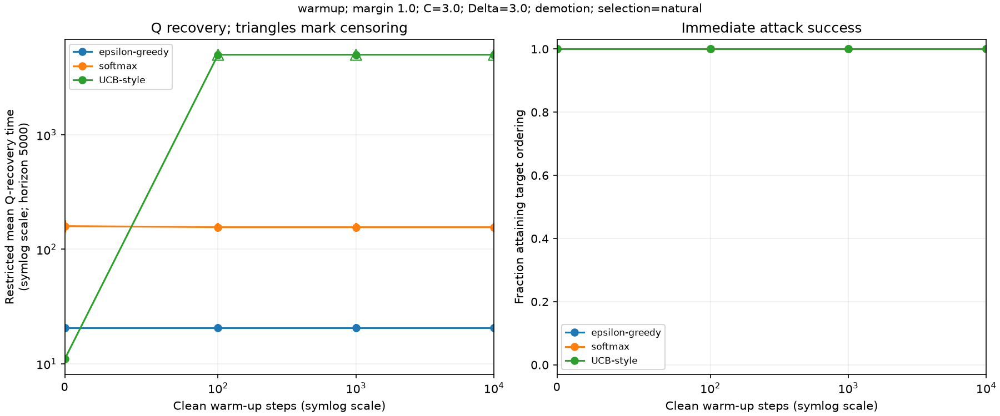
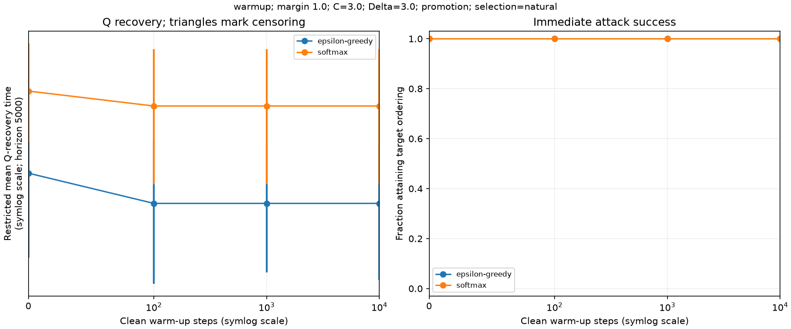

# Reward-poisoning experiment report

Generated UTC: 2026-09-16T22:55:27+00:00

## What we ran

One deterministic decision state with two terminal actions. A clean online warm-up (or explicitly controlled initialization) is followed by one corrected FAA reward intervention, then clean learning. Demotion and promotion are reported separately, with paired clean controls. This is not a multi-state FAA navigation experiment.

Completed pairs represented: **16,016**. Expected jobs: **16016**. Observation horizon: **5,000 clean steps**. Check completion within each condition before comparing partial runs.

Each survival time is a first-event time. Q recovery and the additional confirmation window are distinct. Censored observations remain in restricted means; they are never assigned an actual recovery time at the cutoff.

## Settings and provenance

The exact supplied manifest is [saved here](data/manifest.json).

```json
{
  "schema_version": 1,
  "rewards": [
    1.0,
    0.0
  ],
  "seeds": 500,
  "horizon": 5000,
  "q_tolerance": 0.05,
  "confirmation_window": 20,
  "rules": [
    "epsilon_greedy",
    "softmax",
    "ucb"
  ],
  "learner_defaults": {
    "alpha": 0.9,
    "alpha_schedule": "constant",
    "epsilon": 0.1,
    "temperature": 0.2,
    "beta": 1.0,
    "omega": 0.75
  },
  "designs": [
    {
      "name": "warmup",
      "mode": "warmup",
      "margins": [
        0.01,
        1.0
      ],
      "budgets": [
        1.0,
        3.0
      ],
      "delta_limits": [
        3.0
      ],
      "initializations": [
        {
          "steps": 0,
          "q0": 0.0
        },
        {
          "steps": 100,
          "q0": 0.0
        },
        {
          "steps": 1000,
          "q0": 0.0
        },
        {
          "steps": 10000,
          "q0": 0.0
        }
      ],
      "branches": [
        "natural"
      ]
    }
  ]
}
```

Source: [complete summary](data/summary.csv). All figures below are rebuilt from the supplied data, not copied from older PNGs.

## How to read the results

- First revisit: first clean selection of the intervention action.
- Greedy recovery: first restoration of the genuinely optimal greedy action, using the code tie rule.
- Q recovery: first Q-error within the configured tolerance.
- Q confirmation: the configured consecutive-observation window is completed.
- Restricted mean: mean min(event time, horizon). It is not a full recovery-time estimate when censoring occurs.
- Target attainment: the post-intervention target ordering was achieved; accurate-value damage can exist even when attainment fails.
- Promotion or demotion labels in clean controls refer to the paired intervention action; no poisoning is applied to those controls.

## Findings and limitations to retain

Use the matched-condition tables below to state findings. A large recovery time does not by itself establish reward loss, and a one-state comparison does not establish a universal ranking. Actual warm-up changes both values and counts. Identical results across settings can reflect identical Q-values and shared random streams. UCB runs are deterministic in this task; duplicate seeds would not add evidence. Rare natural promotion branches may have too few observations for a reliable comparison.

## Focal results: demotion after 1000 warm-up steps

These are Q-accuracy recovery times, without the extra confirmation window. Budget is an allowance; the spend column is what was actually used. Read success rate alongside recovery, since failure to attain a target is not immediate repair of a successful attack.

| Rule | Margin | C / Delta | n | Attainment | Mean spend | Restricted Q-recovery mean | Censored |
| --- | --- | --- | --- | --- | --- | --- | --- |
| epsilon-greedy | 0.01 | 1.0 / 3.0 | 474 | 0.0% | 1 | 2.11 | 0 |
| softmax | 0.01 | 1.0 / 3.0 | 498 | 0.0% | 1 | 2.66 | 0 |
| UCB-style | 0.01 | 1.0 / 3.0 | 1 | 0.0% | 1 | 205 | 0 |
| epsilon-greedy | 1.0 | 1.0 / 3.0 | 474 | 0.0% | 1 | 2.11 | 0 |
| softmax | 1.0 | 1.0 / 3.0 | 498 | 0.0% | 1 | 2.66 | 0 |
| UCB-style | 1.0 | 1.0 / 3.0 | 1 | 0.0% | 1 | 205 | 0 |
| epsilon-greedy | 0.01 | 3.0 / 3.0 | 474 | 100.0% | 1.12 | 20.57 | 0 |
| softmax | 0.01 | 3.0 / 3.0 | 498 | 100.0% | 1.12 | 3.13 | 0 |
| UCB-style | 0.01 | 3.0 / 3.0 | 1 | 100.0% | 1.12 | 1,263 | 0 |
| epsilon-greedy | 1.0 | 3.0 / 3.0 | 474 | 100.0% | 2.22 | 20.57 | 0 |
| softmax | 1.0 | 3.0 / 3.0 | 498 | 100.0% | 2.22 | 156.03 | 0 |
| UCB-style | 1.0 | 3.0 / 3.0 | 1 | 100.0% | 2.22 | 5,000 | 1 |


**Unfinished recovery:** UCB-style, margin 1.0, C=3.0: 1 of 1 runs had not reached Q-accuracy by 5000 steps. The capped value is not their actual recovery time.

## Figures

Survival figures use all raw event times in runs.csv, not the coarsely sampled survival CSV.

Trend figures compare warm-up lengths within a fixed margin, budget, cap and branch. Survival panels, when available, focus on 1000 warm-up steps and include both a full view and a 0–200-step zoom. PNG filenames describe their settings.

| PNG | Condition | Measurements | View |
| --- | --- | --- | --- |
| [warmup_eta0_01_budget1_0_cap3_0_natural_demotion_warmup.png](plots/warmup_eta0_01_budget1_0_cap3_0_natural_demotion_warmup.png) | warmup; margin 0.01; C=1.0; Delta=3.0; demotion; selection=natural | Q recovery and attainment | warm-up length |
| [warmup_eta0_01_budget1_0_cap3_0_natural_demotion_steps1000_survival_full.png](plots/warmup_eta0_01_budget1_0_cap3_0_natural_demotion_steps1000_survival_full.png) | warmup; margin 0.01; C=1.0; Delta=3.0; demotion; selection=natural | Four event definitions | warm-up=1000; full |
| [warmup_eta0_01_budget1_0_cap3_0_natural_demotion_steps1000_survival_zoom.png](plots/warmup_eta0_01_budget1_0_cap3_0_natural_demotion_steps1000_survival_zoom.png) | warmup; margin 0.01; C=1.0; Delta=3.0; demotion; selection=natural | Four event definitions | warm-up=1000; zoom |
| [warmup_eta0_01_budget1_0_cap3_0_natural_promotion_warmup.png](plots/warmup_eta0_01_budget1_0_cap3_0_natural_promotion_warmup.png) | warmup; margin 0.01; C=1.0; Delta=3.0; promotion; selection=natural | Q recovery and attainment | warm-up length |
| [warmup_eta0_01_budget1_0_cap3_0_natural_promotion_steps1000_survival_full.png](plots/warmup_eta0_01_budget1_0_cap3_0_natural_promotion_steps1000_survival_full.png) | warmup; margin 0.01; C=1.0; Delta=3.0; promotion; selection=natural | Four event definitions | warm-up=1000; full |
| [warmup_eta0_01_budget1_0_cap3_0_natural_promotion_steps1000_survival_zoom.png](plots/warmup_eta0_01_budget1_0_cap3_0_natural_promotion_steps1000_survival_zoom.png) | warmup; margin 0.01; C=1.0; Delta=3.0; promotion; selection=natural | Four event definitions | warm-up=1000; zoom |
| [warmup_eta0_01_budget3_0_cap3_0_natural_demotion_warmup.png](plots/warmup_eta0_01_budget3_0_cap3_0_natural_demotion_warmup.png) | warmup; margin 0.01; C=3.0; Delta=3.0; demotion; selection=natural | Q recovery and attainment | warm-up length |
| [warmup_eta0_01_budget3_0_cap3_0_natural_demotion_steps1000_survival_full.png](plots/warmup_eta0_01_budget3_0_cap3_0_natural_demotion_steps1000_survival_full.png) | warmup; margin 0.01; C=3.0; Delta=3.0; demotion; selection=natural | Four event definitions | warm-up=1000; full |
| [warmup_eta0_01_budget3_0_cap3_0_natural_demotion_steps1000_survival_zoom.png](plots/warmup_eta0_01_budget3_0_cap3_0_natural_demotion_steps1000_survival_zoom.png) | warmup; margin 0.01; C=3.0; Delta=3.0; demotion; selection=natural | Four event definitions | warm-up=1000; zoom |
| [warmup_eta0_01_budget3_0_cap3_0_natural_promotion_warmup.png](plots/warmup_eta0_01_budget3_0_cap3_0_natural_promotion_warmup.png) | warmup; margin 0.01; C=3.0; Delta=3.0; promotion; selection=natural | Q recovery and attainment | warm-up length |
| [warmup_eta0_01_budget3_0_cap3_0_natural_promotion_steps1000_survival_full.png](plots/warmup_eta0_01_budget3_0_cap3_0_natural_promotion_steps1000_survival_full.png) | warmup; margin 0.01; C=3.0; Delta=3.0; promotion; selection=natural | Four event definitions | warm-up=1000; full |
| [warmup_eta0_01_budget3_0_cap3_0_natural_promotion_steps1000_survival_zoom.png](plots/warmup_eta0_01_budget3_0_cap3_0_natural_promotion_steps1000_survival_zoom.png) | warmup; margin 0.01; C=3.0; Delta=3.0; promotion; selection=natural | Four event definitions | warm-up=1000; zoom |
| [warmup_eta1_0_budget1_0_cap3_0_natural_demotion_warmup.png](plots/warmup_eta1_0_budget1_0_cap3_0_natural_demotion_warmup.png) | warmup; margin 1.0; C=1.0; Delta=3.0; demotion; selection=natural | Q recovery and attainment | warm-up length |
| [warmup_eta1_0_budget1_0_cap3_0_natural_demotion_steps1000_survival_full.png](plots/warmup_eta1_0_budget1_0_cap3_0_natural_demotion_steps1000_survival_full.png) | warmup; margin 1.0; C=1.0; Delta=3.0; demotion; selection=natural | Four event definitions | warm-up=1000; full |
| [warmup_eta1_0_budget1_0_cap3_0_natural_demotion_steps1000_survival_zoom.png](plots/warmup_eta1_0_budget1_0_cap3_0_natural_demotion_steps1000_survival_zoom.png) | warmup; margin 1.0; C=1.0; Delta=3.0; demotion; selection=natural | Four event definitions | warm-up=1000; zoom |
| [warmup_eta1_0_budget1_0_cap3_0_natural_promotion_warmup.png](plots/warmup_eta1_0_budget1_0_cap3_0_natural_promotion_warmup.png) | warmup; margin 1.0; C=1.0; Delta=3.0; promotion; selection=natural | Q recovery and attainment | warm-up length |
| [warmup_eta1_0_budget1_0_cap3_0_natural_promotion_steps1000_survival_full.png](plots/warmup_eta1_0_budget1_0_cap3_0_natural_promotion_steps1000_survival_full.png) | warmup; margin 1.0; C=1.0; Delta=3.0; promotion; selection=natural | Four event definitions | warm-up=1000; full |
| [warmup_eta1_0_budget1_0_cap3_0_natural_promotion_steps1000_survival_zoom.png](plots/warmup_eta1_0_budget1_0_cap3_0_natural_promotion_steps1000_survival_zoom.png) | warmup; margin 1.0; C=1.0; Delta=3.0; promotion; selection=natural | Four event definitions | warm-up=1000; zoom |
| [warmup_eta1_0_budget3_0_cap3_0_natural_demotion_warmup.png](plots/warmup_eta1_0_budget3_0_cap3_0_natural_demotion_warmup.png) | warmup; margin 1.0; C=3.0; Delta=3.0; demotion; selection=natural | Q recovery and attainment | warm-up length |
| [warmup_eta1_0_budget3_0_cap3_0_natural_demotion_steps1000_survival_full.png](plots/warmup_eta1_0_budget3_0_cap3_0_natural_demotion_steps1000_survival_full.png) | warmup; margin 1.0; C=3.0; Delta=3.0; demotion; selection=natural | Four event definitions | warm-up=1000; full |
| [warmup_eta1_0_budget3_0_cap3_0_natural_demotion_steps1000_survival_zoom.png](plots/warmup_eta1_0_budget3_0_cap3_0_natural_demotion_steps1000_survival_zoom.png) | warmup; margin 1.0; C=3.0; Delta=3.0; demotion; selection=natural | Four event definitions | warm-up=1000; zoom |
| [warmup_eta1_0_budget3_0_cap3_0_natural_promotion_warmup.png](plots/warmup_eta1_0_budget3_0_cap3_0_natural_promotion_warmup.png) | warmup; margin 1.0; C=3.0; Delta=3.0; promotion; selection=natural | Q recovery and attainment | warm-up length |
| [warmup_eta1_0_budget3_0_cap3_0_natural_promotion_steps1000_survival_full.png](plots/warmup_eta1_0_budget3_0_cap3_0_natural_promotion_steps1000_survival_full.png) | warmup; margin 1.0; C=3.0; Delta=3.0; promotion; selection=natural | Four event definitions | warm-up=1000; full |
| [warmup_eta1_0_budget3_0_cap3_0_natural_promotion_steps1000_survival_zoom.png](plots/warmup_eta1_0_budget3_0_cap3_0_natural_promotion_steps1000_survival_zoom.png) | warmup; margin 1.0; C=3.0; Delta=3.0; promotion; selection=natural | Four event definitions | warm-up=1000; zoom |


## warmup; margin 0.01; C=1.0; Delta=3.0; demotion; selection=natural

[Open warm-up comparison](plots/warmup_eta0_01_budget1_0_cap3_0_natural_demotion_warmup.png)



| Initialization | Rule | Metric | n | Clean restricted mean | FAA restricted mean | FAA 95% CI | Median; Q25–Q75 | Censored | Paired FAA − clean |
| --- | --- | --- | --- | --- | --- | --- | --- | --- | --- |
| {"q0": 0.0, "steps": 0} | epsilon-greedy | first_revisit | 474 | 1.05 | 1.05 | [1.03, 1.07] | 1; 1–1 | 0 | 0 |
| {"q0": 0.0, "steps": 0} | epsilon-greedy | greedy_recovery | 474 | 0 | 0 | [0, 0] | 0; 0–0 | 0 | 0 |
| {"q0": 0.0, "steps": 0} | epsilon-greedy | q_recovery | 474 | 1.05 | 2.11 | [2.09, 2.15] | 2; 2–2 | 0 | 1.06 |
| {"q0": 0.0, "steps": 0} | epsilon-greedy | q_confirmation | 474 | 20.05 | 21.11 | [21.09, 21.15] | 21; 21–21 | 0 | 1.06 |
| {"q0": 0.0, "steps": 0} | softmax | first_revisit | 236 | 1.02 | 1.94 | [1.78, 2.1] | 1; 1–2 | 0 | 0.92 |
| {"q0": 0.0, "steps": 0} | softmax | greedy_recovery | 236 | 0 | 0 | [0, 0] | 0; 0–0 | 0 | 0 |
| {"q0": 0.0, "steps": 0} | softmax | q_recovery | 236 | 1.02 | 2.94 | [2.8, 3.12] | 2; 2–3 | 0 | 1.93 |
| {"q0": 0.0, "steps": 0} | softmax | q_confirmation | 236 | 20.02 | 21.94 | [21.78, 22.11] | 21; 21–22 | 0 | 1.93 |
| {"q0": 0.0, "steps": 0} | UCB-style | first_revisit | 1 | 2 | 2 | not estimated | 2; 2–2 | 0 | 0 |
| {"q0": 0.0, "steps": 0} | UCB-style | greedy_recovery | 1 | 0 | 0 | not estimated | 0; 0–0 | 0 | 0 |
| {"q0": 0.0, "steps": 0} | UCB-style | q_recovery | 1 | 2 | 3 | not estimated | 3; 3–3 | 0 | 1 |
| {"q0": 0.0, "steps": 0} | UCB-style | q_confirmation | 1 | 21 | 22 | not estimated | 22; 22–22 | 0 | 1 |
| {"q0": 0.0, "steps": 10000} | epsilon-greedy | first_revisit | 474 | 1.05 | 1.05 | [1.03, 1.07] | 1; 1–1 | 0 | 0 |
| {"q0": 0.0, "steps": 10000} | epsilon-greedy | greedy_recovery | 474 | 0 | 0 | [0, 0] | 0; 0–0 | 0 | 0 |
| {"q0": 0.0, "steps": 10000} | epsilon-greedy | q_recovery | 474 | 0 | 2.11 | [2.08, 2.14] | 2; 2–2 | 0 | 2.11 |
| {"q0": 0.0, "steps": 10000} | epsilon-greedy | q_confirmation | 474 | 19 | 21.11 | [21.08, 21.15] | 21; 21–21 | 0 | 2.11 |
| {"q0": 0.0, "steps": 10000} | softmax | first_revisit | 498 | 1.01 | 1.65 | [1.56, 1.74] | 1; 1–2 | 0 | 0.65 |
| {"q0": 0.0, "steps": 10000} | softmax | greedy_recovery | 498 | 0 | 0 | [0, 0] | 0; 0–0 | 0 | 0 |
| {"q0": 0.0, "steps": 10000} | softmax | q_recovery | 498 | 0 | 2.66 | [2.57, 2.75] | 2; 2–3 | 0 | 2.66 |
| {"q0": 0.0, "steps": 10000} | softmax | q_confirmation | 498 | 19 | 21.66 | [21.56, 21.76] | 21; 21–22 | 0 | 2.66 |
| {"q0": 0.0, "steps": 10000} | UCB-style | first_revisit | 1 | 1 | 537 | not estimated | 537; 537–537 | 0 | 536 |
| {"q0": 0.0, "steps": 10000} | UCB-style | greedy_recovery | 1 | 0 | 0 | not estimated | 0; 0–0 | 0 | 0 |
| {"q0": 0.0, "steps": 10000} | UCB-style | q_recovery | 1 | 0 | 538 | not estimated | 538; 538–538 | 0 | 538 |
| {"q0": 0.0, "steps": 10000} | UCB-style | q_confirmation | 1 | 19 | 557 | not estimated | 557; 557–557 | 0 | 538 |
| {"q0": 0.0, "steps": 1000} | epsilon-greedy | first_revisit | 474 | 1.05 | 1.05 | [1.03, 1.07] | 1; 1–1 | 0 | 0 |
| {"q0": 0.0, "steps": 1000} | epsilon-greedy | greedy_recovery | 474 | 0 | 0 | [0, 0] | 0; 0–0 | 0 | 0 |
| {"q0": 0.0, "steps": 1000} | epsilon-greedy | q_recovery | 474 | 0 | 2.11 | [2.09, 2.14] | 2; 2–2 | 0 | 2.11 |
| {"q0": 0.0, "steps": 1000} | epsilon-greedy | q_confirmation | 474 | 19 | 21.11 | [21.09, 21.14] | 21; 21–21 | 0 | 2.11 |
| {"q0": 0.0, "steps": 1000} | softmax | first_revisit | 498 | 1.01 | 1.65 | [1.57, 1.75] | 1; 1–2 | 0 | 0.65 |
| {"q0": 0.0, "steps": 1000} | softmax | greedy_recovery | 498 | 0 | 0 | [0, 0] | 0; 0–0 | 0 | 0 |
| {"q0": 0.0, "steps": 1000} | softmax | q_recovery | 498 | 0 | 2.66 | [2.57, 2.75] | 2; 2–3 | 0 | 2.66 |
| {"q0": 0.0, "steps": 1000} | softmax | q_confirmation | 498 | 19 | 21.66 | [21.57, 21.75] | 21; 21–22 | 0 | 2.66 |
| {"q0": 0.0, "steps": 1000} | UCB-style | first_revisit | 1 | 1 | 204 | not estimated | 204; 204–204 | 0 | 203 |
| {"q0": 0.0, "steps": 1000} | UCB-style | greedy_recovery | 1 | 0 | 0 | not estimated | 0; 0–0 | 0 | 0 |
| {"q0": 0.0, "steps": 1000} | UCB-style | q_recovery | 1 | 0 | 205 | not estimated | 205; 205–205 | 0 | 205 |
| {"q0": 0.0, "steps": 1000} | UCB-style | q_confirmation | 1 | 19 | 224 | not estimated | 224; 224–224 | 0 | 205 |
| {"q0": 0.0, "steps": 100} | epsilon-greedy | first_revisit | 474 | 1.05 | 1.05 | [1.03, 1.07] | 1; 1–1 | 0 | 0 |
| {"q0": 0.0, "steps": 100} | epsilon-greedy | greedy_recovery | 474 | 0 | 0 | [0, 0] | 0; 0–0 | 0 | 0 |
| {"q0": 0.0, "steps": 100} | epsilon-greedy | q_recovery | 474 | 0 | 2.11 | [2.09, 2.15] | 2; 2–2 | 0 | 2.11 |
| {"q0": 0.0, "steps": 100} | epsilon-greedy | q_confirmation | 474 | 19 | 21.11 | [21.08, 21.15] | 21; 21–21 | 0 | 2.11 |
| {"q0": 0.0, "steps": 100} | softmax | first_revisit | 498 | 1.01 | 1.65 | [1.57, 1.75] | 1; 1–2 | 0 | 0.65 |
| {"q0": 0.0, "steps": 100} | softmax | greedy_recovery | 498 | 0 | 0 | [0, 0] | 0; 0–0 | 0 | 0 |
| {"q0": 0.0, "steps": 100} | softmax | q_recovery | 498 | 0 | 2.66 | [2.57, 2.76] | 2; 2–3 | 0 | 2.66 |
| {"q0": 0.0, "steps": 100} | softmax | q_confirmation | 498 | 19 | 21.66 | [21.57, 21.76] | 21; 21–22 | 0 | 2.66 |
| {"q0": 0.0, "steps": 100} | UCB-style | first_revisit | 1 | 1 | 44 | not estimated | 44; 44–44 | 0 | 43 |
| {"q0": 0.0, "steps": 100} | UCB-style | greedy_recovery | 1 | 0 | 0 | not estimated | 0; 0–0 | 0 | 0 |
| {"q0": 0.0, "steps": 100} | UCB-style | q_recovery | 1 | 0 | 45 | not estimated | 45; 45–45 | 0 | 45 |
| {"q0": 0.0, "steps": 100} | UCB-style | q_confirmation | 1 | 19 | 64 | not estimated | 64; 64–64 | 0 | 45 |


| Initialization | Rule | n | Target attainment | Spend min–max | Clipped | Pre-attack Q-error | Mean counts: optimal / other |
| --- | --- | --- | --- | --- | --- | --- | --- |
| {"q0": 0.0, "steps": 1000} | UCB-style | 1 | 0.0% | 1–1 | 1 | 0 | 994 / 6 |
| {"q0": 0.0, "steps": 1000} | epsilon-greedy | 474 | 0.0% | 1–1 | 474 | 0 | 950.04 / 49.96 |
| {"q0": 0.0, "steps": 10000} | UCB-style | 1 | 0.0% | 1–1 | 1 | 0 | 9,991 / 9 |
| {"q0": 0.0, "steps": 100} | softmax | 498 | 0.0% | 1–1 | 498 | 0 | 98.38 / 1.62 |
| {"q0": 0.0, "steps": 0} | softmax | 236 | 0.0% | 1–1 | 236 | 1 | 0 / 0 |
| {"q0": 0.0, "steps": 100} | UCB-style | 1 | 0.0% | 1–1 | 1 | 0 | 96 / 4 |
| {"q0": 0.0, "steps": 0} | epsilon-greedy | 474 | 0.0% | 1–1 | 474 | 1 | 0 / 0 |
| {"q0": 0.0, "steps": 10000} | epsilon-greedy | 474 | 0.0% | 1–1 | 474 | 0 | 9,499.73 / 500.27 |
| {"q0": 0.0, "steps": 0} | UCB-style | 1 | 0.0% | 1–1 | 1 | 1 | 0 / 0 |
| {"q0": 0.0, "steps": 1000} | softmax | 498 | 0.0% | 1–1 | 498 | 0 | 992.4 / 7.6 |
| {"q0": 0.0, "steps": 100} | epsilon-greedy | 474 | 0.0% | 1–1 | 474 | 0 | 94.98 / 5.02 |
| {"q0": 0.0, "steps": 10000} | softmax | 498 | 0.0% | 1–1 | 498 | 0 | 9,932.27 / 67.73 |


[Open matched survival comparison (full)](plots/warmup_eta0_01_budget1_0_cap3_0_natural_demotion_steps1000_survival_full.png)

[Open matched survival comparison (zoom)](plots/warmup_eta0_01_budget1_0_cap3_0_natural_demotion_steps1000_survival_zoom.png)

## warmup; margin 0.01; C=1.0; Delta=3.0; promotion; selection=natural

[Open warm-up comparison](plots/warmup_eta0_01_budget1_0_cap3_0_natural_promotion_warmup.png)



| Initialization | Rule | Metric | n | Clean restricted mean | FAA restricted mean | FAA 95% CI | Median; Q25–Q75 | Censored | Paired FAA − clean |
| --- | --- | --- | --- | --- | --- | --- | --- | --- | --- |
| {"q0": 0.0, "steps": 0} | epsilon-greedy | first_revisit | 26 | 20.73 | 1 | [1, 1] | 1; 1–1 | 0 | -19.73 |
| {"q0": 0.0, "steps": 0} | epsilon-greedy | greedy_recovery | 26 | 0 | 21.96 | [13.42, 32.46] | 13; 6–31 | 0 | 21.96 |
| {"q0": 0.0, "steps": 0} | epsilon-greedy | q_recovery | 26 | 2.12 | 23.04 | [15.27, 34.04] | 14; 7–33 | 0 | 20.92 |
| {"q0": 0.0, "steps": 0} | epsilon-greedy | q_confirmation | 26 | 21.12 | 42.04 | [33.92, 53.16] | 33; 26–52 | 0 | 20.92 |
| {"q0": 0.0, "steps": 0} | softmax | first_revisit | 264 | 78.88 | 71.41 | [56.11, 91.4] | 1; 1–82 | 0 | -7.47 |
| {"q0": 0.0, "steps": 0} | softmax | greedy_recovery | 264 | 0 | 2.19 | [2.02, 2.39] | 2; 1–3 | 0 | 2.19 |
| {"q0": 0.0, "steps": 0} | softmax | q_recovery | 264 | 3.14 | 3.2 | [3.02, 3.39] | 3; 2–4 | 0 | 0.06 |
| {"q0": 0.0, "steps": 0} | softmax | q_confirmation | 264 | 22.14 | 22.2 | [22.03, 22.4] | 22; 21–23 | 0 | 0.06 |
| {"q0": 0.0, "steps": 10000} | epsilon-greedy | first_revisit | 26 | 20.73 | 20.73 | [14.26, 28.42] | 12; 6–32 | 0 | 0 |
| {"q0": 0.0, "steps": 10000} | epsilon-greedy | greedy_recovery | 26 | 0 | 0 | [0, 0] | 0; 0–0 | 0 | 0 |
| {"q0": 0.0, "steps": 10000} | epsilon-greedy | q_recovery | 26 | 0 | 40.81 | [30.73, 52.46] | 37; 15–59 | 0 | 40.81 |
| {"q0": 0.0, "steps": 10000} | epsilon-greedy | q_confirmation | 26 | 19 | 59.81 | [49.81, 70.69] | 56; 34–78 | 0 | 40.81 |
| {"q0": 0.0, "steps": 10000} | softmax | first_revisit | 2 | 76 | 2 | [1, 3] | 1; 1–3 | 0 | -74 |
| {"q0": 0.0, "steps": 10000} | softmax | greedy_recovery | 2 | 0 | 0 | [0, 0] | 0; 0–0 | 0 | 0 |
| {"q0": 0.0, "steps": 10000} | softmax | q_recovery | 2 | 0 | 33.5 | [23, 44] | 23; 23–44 | 0 | 33.5 |
| {"q0": 0.0, "steps": 10000} | softmax | q_confirmation | 2 | 19 | 52.5 | [42, 63] | 42; 42–63 | 0 | 33.5 |
| {"q0": 0.0, "steps": 1000} | epsilon-greedy | first_revisit | 26 | 20.73 | 20.73 | [14.38, 28.16] | 12; 6–32 | 0 | 0 |
| {"q0": 0.0, "steps": 1000} | epsilon-greedy | greedy_recovery | 26 | 0 | 0 | [0, 0] | 0; 0–0 | 0 | 0 |
| {"q0": 0.0, "steps": 1000} | epsilon-greedy | q_recovery | 26 | 0 | 40.81 | [29.84, 51.35] | 37; 15–59 | 0 | 40.81 |
| {"q0": 0.0, "steps": 1000} | epsilon-greedy | q_confirmation | 26 | 19 | 59.81 | [48.76, 71.31] | 56; 34–78 | 0 | 40.81 |
| {"q0": 0.0, "steps": 1000} | softmax | first_revisit | 2 | 76 | 2 | [1, 3] | 1; 1–3 | 0 | -74 |
| {"q0": 0.0, "steps": 1000} | softmax | greedy_recovery | 2 | 0 | 0 | [0, 0] | 0; 0–0 | 0 | 0 |
| {"q0": 0.0, "steps": 1000} | softmax | q_recovery | 2 | 0 | 33.5 | [23, 44] | 23; 23–44 | 0 | 33.5 |
| {"q0": 0.0, "steps": 1000} | softmax | q_confirmation | 2 | 19 | 52.5 | [42, 63] | 42; 42–63 | 0 | 33.5 |
| {"q0": 0.0, "steps": 100} | epsilon-greedy | first_revisit | 26 | 20.73 | 20.73 | [14.15, 27.89] | 12; 6–32 | 0 | 0 |
| {"q0": 0.0, "steps": 100} | epsilon-greedy | greedy_recovery | 26 | 0 | 0 | [0, 0] | 0; 0–0 | 0 | 0 |
| {"q0": 0.0, "steps": 100} | epsilon-greedy | q_recovery | 26 | 0 | 40.81 | [30.38, 51.31] | 37; 15–59 | 0 | 40.81 |
| {"q0": 0.0, "steps": 100} | epsilon-greedy | q_confirmation | 26 | 19 | 59.81 | [49.85, 70.12] | 56; 34–78 | 0 | 40.81 |
| {"q0": 0.0, "steps": 100} | softmax | first_revisit | 2 | 76 | 2 | [1, 3] | 1; 1–3 | 0 | -74 |
| {"q0": 0.0, "steps": 100} | softmax | greedy_recovery | 2 | 0 | 0 | [0, 0] | 0; 0–0 | 0 | 0 |
| {"q0": 0.0, "steps": 100} | softmax | q_recovery | 2 | 0 | 33.5 | [23, 44] | 23; 23–44 | 0 | 33.5 |
| {"q0": 0.0, "steps": 100} | softmax | q_confirmation | 2 | 19 | 52.5 | [42, 63] | 42; 42–63 | 0 | 33.5 |


| Initialization | Rule | n | Target attainment | Spend min–max | Clipped | Pre-attack Q-error | Mean counts: optimal / other |
| --- | --- | --- | --- | --- | --- | --- | --- |
| {"q0": 0.0, "steps": 1000} | epsilon-greedy | 26 | 0.0% | 1–1 | 26 | 0 | 948.77 / 51.23 |
| {"q0": 0.0, "steps": 100} | softmax | 2 | 0.0% | 1–1 | 2 | 0 | 98 / 2 |
| {"q0": 0.0, "steps": 0} | softmax | 264 | 100.0% | 0.01–0.01 | 0 | 1 | 0 / 0 |
| {"q0": 0.0, "steps": 0} | epsilon-greedy | 26 | 100.0% | 0.01–0.01 | 0 | 1 | 0 / 0 |
| {"q0": 0.0, "steps": 10000} | epsilon-greedy | 26 | 0.0% | 1–1 | 26 | 0 | 9,494.08 / 505.92 |
| {"q0": 0.0, "steps": 1000} | softmax | 2 | 0.0% | 1–1 | 2 | 0 | 993 / 7 |
| {"q0": 0.0, "steps": 100} | epsilon-greedy | 26 | 0.0% | 1–1 | 26 | 0 | 94.08 / 5.92 |
| {"q0": 0.0, "steps": 10000} | softmax | 2 | 0.0% | 1–1 | 2 | 0 | 9,930.5 / 69.5 |


**Small branch samples:** epsilon-greedy {'q0': 0.0, 'steps': 1000}: n=26; softmax {'q0': 0.0, 'steps': 100}: n=2; epsilon-greedy {'q0': 0.0, 'steps': 0}: n=26; epsilon-greedy {'q0': 0.0, 'steps': 10000}: n=26; softmax {'q0': 0.0, 'steps': 1000}: n=2; epsilon-greedy {'q0': 0.0, 'steps': 100}: n=26; softmax {'q0': 0.0, 'steps': 10000}: n=2. Interpret their means cautiously.

[Open matched survival comparison (full)](plots/warmup_eta0_01_budget1_0_cap3_0_natural_promotion_steps1000_survival_full.png)

[Open matched survival comparison (zoom)](plots/warmup_eta0_01_budget1_0_cap3_0_natural_promotion_steps1000_survival_zoom.png)

## warmup; margin 0.01; C=3.0; Delta=3.0; demotion; selection=natural

[Open warm-up comparison](plots/warmup_eta0_01_budget3_0_cap3_0_natural_demotion_warmup.png)



| Initialization | Rule | Metric | n | Clean restricted mean | FAA restricted mean | FAA 95% CI | Median; Q25–Q75 | Censored | Paired FAA − clean |
| --- | --- | --- | --- | --- | --- | --- | --- | --- | --- |
| {"q0": 0.0, "steps": 0} | epsilon-greedy | first_revisit | 474 | 1.05 | 19.51 | [17.89, 21.18] | 14; 6–26 | 0 | 18.46 |
| {"q0": 0.0, "steps": 0} | epsilon-greedy | greedy_recovery | 474 | 0 | 19.51 | [17.71, 21.34] | 14; 6–26 | 0 | 19.51 |
| {"q0": 0.0, "steps": 0} | epsilon-greedy | q_recovery | 474 | 1.05 | 20.57 | [18.95, 22.42] | 15; 7–27 | 0 | 19.52 |
| {"q0": 0.0, "steps": 0} | epsilon-greedy | q_confirmation | 474 | 20.05 | 39.57 | [37.84, 41.37] | 34; 26–46 | 0 | 19.52 |
| {"q0": 0.0, "steps": 0} | softmax | first_revisit | 236 | 1.02 | 2.03 | [1.85, 2.22] | 1; 1–3 | 0 | 1.01 |
| {"q0": 0.0, "steps": 0} | softmax | greedy_recovery | 236 | 0 | 2.03 | [1.84, 2.24] | 1; 1–3 | 0 | 2.03 |
| {"q0": 0.0, "steps": 0} | softmax | q_recovery | 236 | 1.02 | 3.03 | [2.85, 3.23] | 2; 2–4 | 0 | 2.01 |
| {"q0": 0.0, "steps": 0} | softmax | q_confirmation | 236 | 20.02 | 22.03 | [21.84, 22.22] | 21; 21–23 | 0 | 2.01 |
| {"q0": 0.0, "steps": 0} | UCB-style | first_revisit | 1 | 2 | 3 | not estimated | 3; 3–3 | 0 | 1 |
| {"q0": 0.0, "steps": 0} | UCB-style | greedy_recovery | 1 | 0 | 3 | not estimated | 3; 3–3 | 0 | 3 |
| {"q0": 0.0, "steps": 0} | UCB-style | q_recovery | 1 | 2 | 4 | not estimated | 4; 4–4 | 0 | 2 |
| {"q0": 0.0, "steps": 0} | UCB-style | q_confirmation | 1 | 21 | 23 | not estimated | 23; 23–23 | 0 | 2 |
| {"q0": 0.0, "steps": 10000} | epsilon-greedy | first_revisit | 474 | 1.05 | 19.51 | [17.89, 21.12] | 14; 6–26 | 0 | 18.46 |
| {"q0": 0.0, "steps": 10000} | epsilon-greedy | greedy_recovery | 474 | 0 | 19.51 | [17.93, 21.04] | 14; 6–26 | 0 | 19.51 |
| {"q0": 0.0, "steps": 10000} | epsilon-greedy | q_recovery | 474 | 0 | 20.57 | [19.01, 22.19] | 15; 7–27 | 0 | 20.57 |
| {"q0": 0.0, "steps": 10000} | epsilon-greedy | q_confirmation | 474 | 19 | 39.57 | [38.02, 41.28] | 34; 26–46 | 0 | 20.57 |
| {"q0": 0.0, "steps": 10000} | softmax | first_revisit | 498 | 1.01 | 2.13 | [1.99, 2.27] | 2; 1–3 | 0 | 1.12 |
| {"q0": 0.0, "steps": 10000} | softmax | greedy_recovery | 498 | 0 | 2.13 | [2, 2.26] | 2; 1–3 | 0 | 2.13 |
| {"q0": 0.0, "steps": 10000} | softmax | q_recovery | 498 | 0 | 3.13 | [3, 3.26] | 3; 2–4 | 0 | 3.13 |
| {"q0": 0.0, "steps": 10000} | softmax | q_confirmation | 498 | 19 | 22.13 | [21.99, 22.27] | 22; 21–23 | 0 | 3.13 |
| {"q0": 0.0, "steps": 10000} | UCB-style | first_revisit | 1 | 1 | 5,000 | not estimated | not observed / unavailable; not observed / unavailable–not observed / unavailable | 1 | 4,999 |
| {"q0": 0.0, "steps": 10000} | UCB-style | greedy_recovery | 1 | 0 | 5,000 | not estimated | not observed / unavailable; not observed / unavailable–not observed / unavailable | 1 | 5,000 |
| {"q0": 0.0, "steps": 10000} | UCB-style | q_recovery | 1 | 0 | 5,000 | not estimated | not observed / unavailable; not observed / unavailable–not observed / unavailable | 1 | 5,000 |
| {"q0": 0.0, "steps": 10000} | UCB-style | q_confirmation | 1 | 19 | 5,000 | not estimated | not observed / unavailable; not observed / unavailable–not observed / unavailable | 1 | 4,981 |
| {"q0": 0.0, "steps": 1000} | epsilon-greedy | first_revisit | 474 | 1.05 | 19.51 | [17.99, 21.11] | 14; 6–26 | 0 | 18.46 |
| {"q0": 0.0, "steps": 1000} | epsilon-greedy | greedy_recovery | 474 | 0 | 19.51 | [17.88, 21.36] | 14; 6–26 | 0 | 19.51 |
| {"q0": 0.0, "steps": 1000} | epsilon-greedy | q_recovery | 474 | 0 | 20.57 | [18.96, 22.18] | 15; 7–27 | 0 | 20.57 |
| {"q0": 0.0, "steps": 1000} | epsilon-greedy | q_confirmation | 474 | 19 | 39.57 | [37.81, 41.17] | 34; 26–46 | 0 | 20.57 |
| {"q0": 0.0, "steps": 1000} | softmax | first_revisit | 498 | 1.01 | 2.13 | [1.99, 2.26] | 2; 1–3 | 0 | 1.12 |
| {"q0": 0.0, "steps": 1000} | softmax | greedy_recovery | 498 | 0 | 2.13 | [2, 2.28] | 2; 1–3 | 0 | 2.13 |
| {"q0": 0.0, "steps": 1000} | softmax | q_recovery | 498 | 0 | 3.13 | [2.99, 3.28] | 3; 2–4 | 0 | 3.13 |
| {"q0": 0.0, "steps": 1000} | softmax | q_confirmation | 498 | 19 | 22.13 | [22, 22.28] | 22; 21–23 | 0 | 3.13 |
| {"q0": 0.0, "steps": 1000} | UCB-style | first_revisit | 1 | 1 | 1,262 | not estimated | 1,262; 1,262–1,262 | 0 | 1,261 |
| {"q0": 0.0, "steps": 1000} | UCB-style | greedy_recovery | 1 | 0 | 1,262 | not estimated | 1,262; 1,262–1,262 | 0 | 1,262 |
| {"q0": 0.0, "steps": 1000} | UCB-style | q_recovery | 1 | 0 | 1,263 | not estimated | 1,263; 1,263–1,263 | 0 | 1,263 |
| {"q0": 0.0, "steps": 1000} | UCB-style | q_confirmation | 1 | 19 | 1,282 | not estimated | 1,282; 1,282–1,282 | 0 | 1,263 |
| {"q0": 0.0, "steps": 100} | epsilon-greedy | first_revisit | 474 | 1.05 | 19.51 | [17.79, 21.08] | 14; 6–26 | 0 | 18.46 |
| {"q0": 0.0, "steps": 100} | epsilon-greedy | greedy_recovery | 474 | 0 | 19.51 | [17.8, 21.32] | 14; 6–26 | 0 | 19.51 |
| {"q0": 0.0, "steps": 100} | epsilon-greedy | q_recovery | 474 | 0 | 20.57 | [18.88, 22.16] | 15; 7–27 | 0 | 20.57 |
| {"q0": 0.0, "steps": 100} | epsilon-greedy | q_confirmation | 474 | 19 | 39.57 | [37.89, 41.36] | 34; 26–46 | 0 | 20.57 |
| {"q0": 0.0, "steps": 100} | softmax | first_revisit | 498 | 1.01 | 2.13 | [1.99, 2.26] | 2; 1–3 | 0 | 1.12 |
| {"q0": 0.0, "steps": 100} | softmax | greedy_recovery | 498 | 0 | 2.13 | [1.99, 2.27] | 2; 1–3 | 0 | 2.13 |
| {"q0": 0.0, "steps": 100} | softmax | q_recovery | 498 | 0 | 3.13 | [3, 3.27] | 3; 2–4 | 0 | 3.13 |
| {"q0": 0.0, "steps": 100} | softmax | q_confirmation | 498 | 19 | 22.13 | [22, 22.28] | 22; 21–23 | 0 | 3.13 |
| {"q0": 0.0, "steps": 100} | UCB-style | first_revisit | 1 | 1 | 103 | not estimated | 103; 103–103 | 0 | 102 |
| {"q0": 0.0, "steps": 100} | UCB-style | greedy_recovery | 1 | 0 | 103 | not estimated | 103; 103–103 | 0 | 103 |
| {"q0": 0.0, "steps": 100} | UCB-style | q_recovery | 1 | 0 | 104 | not estimated | 104; 104–104 | 0 | 104 |
| {"q0": 0.0, "steps": 100} | UCB-style | q_confirmation | 1 | 19 | 123 | not estimated | 123; 123–123 | 0 | 104 |


| Initialization | Rule | n | Target attainment | Spend min–max | Clipped | Pre-attack Q-error | Mean counts: optimal / other |
| --- | --- | --- | --- | --- | --- | --- | --- |
| {"q0": 0.0, "steps": 10000} | softmax | 498 | 100.0% | 1.12–1.12 | 0 | 0 | 9,932.27 / 67.73 |
| {"q0": 0.0, "steps": 0} | UCB-style | 1 | 100.0% | 1.01–1.01 | 0 | 1 | 0 / 0 |
| {"q0": 0.0, "steps": 10000} | epsilon-greedy | 474 | 100.0% | 1.12–1.12 | 0 | 0 | 9,499.73 / 500.27 |
| {"q0": 0.0, "steps": 0} | epsilon-greedy | 474 | 100.0% | 1.01–1.01 | 0 | 1 | 0 / 0 |
| {"q0": 0.0, "steps": 1000} | epsilon-greedy | 474 | 100.0% | 1.12–1.12 | 0 | 0 | 950.04 / 49.96 |
| {"q0": 0.0, "steps": 100} | UCB-style | 1 | 100.0% | 1.12–1.12 | 0 | 0 | 96 / 4 |
| {"q0": 0.0, "steps": 0} | softmax | 236 | 100.0% | 1.01–1.01 | 0 | 1 | 0 / 0 |
| {"q0": 0.0, "steps": 10000} | UCB-style | 1 | 100.0% | 1.12–1.12 | 0 | 0 | 9,991 / 9 |
| {"q0": 0.0, "steps": 100} | epsilon-greedy | 474 | 100.0% | 1.12–1.12 | 0 | 0 | 94.98 / 5.02 |
| {"q0": 0.0, "steps": 100} | softmax | 498 | 100.0% | 1.12–1.12 | 0 | 0 | 98.38 / 1.62 |
| {"q0": 0.0, "steps": 1000} | softmax | 498 | 100.0% | 1.12–1.12 | 0 | 0 | 992.4 / 7.6 |
| {"q0": 0.0, "steps": 1000} | UCB-style | 1 | 100.0% | 1.12–1.12 | 0 | 0 | 994 / 6 |


[Open matched survival comparison (full)](plots/warmup_eta0_01_budget3_0_cap3_0_natural_demotion_steps1000_survival_full.png)

[Open matched survival comparison (zoom)](plots/warmup_eta0_01_budget3_0_cap3_0_natural_demotion_steps1000_survival_zoom.png)

## warmup; margin 0.01; C=3.0; Delta=3.0; promotion; selection=natural

[Open warm-up comparison](plots/warmup_eta0_01_budget3_0_cap3_0_natural_promotion_warmup.png)



| Initialization | Rule | Metric | n | Clean restricted mean | FAA restricted mean | FAA 95% CI | Median; Q25–Q75 | Censored | Paired FAA − clean |
| --- | --- | --- | --- | --- | --- | --- | --- | --- | --- |
| {"q0": 0.0, "steps": 0} | epsilon-greedy | first_revisit | 26 | 20.73 | 1 | [1, 1] | 1; 1–1 | 0 | -19.73 |
| {"q0": 0.0, "steps": 0} | epsilon-greedy | greedy_recovery | 26 | 0 | 21.96 | [13.5, 32.58] | 13; 6–31 | 0 | 21.96 |
| {"q0": 0.0, "steps": 0} | epsilon-greedy | q_recovery | 26 | 2.12 | 23.04 | [15.04, 34.5] | 14; 7–33 | 0 | 20.92 |
| {"q0": 0.0, "steps": 0} | epsilon-greedy | q_confirmation | 26 | 21.12 | 42.04 | [33.92, 52.2] | 33; 26–52 | 0 | 20.92 |
| {"q0": 0.0, "steps": 0} | softmax | first_revisit | 264 | 78.88 | 71.41 | [53.65, 92.22] | 1; 1–82 | 0 | -7.47 |
| {"q0": 0.0, "steps": 0} | softmax | greedy_recovery | 264 | 0 | 2.19 | [2, 2.38] | 2; 1–3 | 0 | 2.19 |
| {"q0": 0.0, "steps": 0} | softmax | q_recovery | 264 | 3.14 | 3.2 | [3.02, 3.39] | 3; 2–4 | 0 | 0.06 |
| {"q0": 0.0, "steps": 0} | softmax | q_confirmation | 264 | 22.14 | 22.2 | [22.02, 22.37] | 22; 21–23 | 0 | 0.06 |
| {"q0": 0.0, "steps": 10000} | epsilon-greedy | first_revisit | 26 | 20.73 | 1 | [1, 1] | 1; 1–1 | 0 | -19.73 |
| {"q0": 0.0, "steps": 10000} | epsilon-greedy | greedy_recovery | 26 | 0 | 1 | [1, 1] | 1; 1–1 | 0 | 1 |
| {"q0": 0.0, "steps": 10000} | epsilon-greedy | q_recovery | 26 | 0 | 21 | [14.81, 27.92] | 12; 8–32 | 0 | 21 |
| {"q0": 0.0, "steps": 10000} | epsilon-greedy | q_confirmation | 26 | 19 | 40 | [33.35, 46.42] | 31; 27–51 | 0 | 21 |
| {"q0": 0.0, "steps": 10000} | softmax | first_revisit | 2 | 76 | 2 | [1, 3] | 1; 1–3 | 0 | -74 |
| {"q0": 0.0, "steps": 10000} | softmax | greedy_recovery | 2 | 0 | 2 | [1, 3] | 1; 1–3 | 0 | 2 |
| {"q0": 0.0, "steps": 10000} | softmax | q_recovery | 2 | 0 | 33.5 | [23, 44] | 23; 23–44 | 0 | 33.5 |
| {"q0": 0.0, "steps": 10000} | softmax | q_confirmation | 2 | 19 | 52.5 | [42, 63] | 42; 42–63 | 0 | 33.5 |
| {"q0": 0.0, "steps": 1000} | epsilon-greedy | first_revisit | 26 | 20.73 | 1 | [1, 1] | 1; 1–1 | 0 | -19.73 |
| {"q0": 0.0, "steps": 1000} | epsilon-greedy | greedy_recovery | 26 | 0 | 1 | [1, 1] | 1; 1–1 | 0 | 1 |
| {"q0": 0.0, "steps": 1000} | epsilon-greedy | q_recovery | 26 | 0 | 21 | [14.58, 27.89] | 12; 8–32 | 0 | 21 |
| {"q0": 0.0, "steps": 1000} | epsilon-greedy | q_confirmation | 26 | 19 | 40 | [33.96, 47.04] | 31; 27–51 | 0 | 21 |
| {"q0": 0.0, "steps": 1000} | softmax | first_revisit | 2 | 76 | 2 | [1, 3] | 1; 1–3 | 0 | -74 |
| {"q0": 0.0, "steps": 1000} | softmax | greedy_recovery | 2 | 0 | 2 | [1, 3] | 1; 1–3 | 0 | 2 |
| {"q0": 0.0, "steps": 1000} | softmax | q_recovery | 2 | 0 | 33.5 | [23, 44] | 23; 23–44 | 0 | 33.5 |
| {"q0": 0.0, "steps": 1000} | softmax | q_confirmation | 2 | 19 | 52.5 | [42, 63] | 42; 42–63 | 0 | 33.5 |
| {"q0": 0.0, "steps": 100} | epsilon-greedy | first_revisit | 26 | 20.73 | 1 | [1, 1] | 1; 1–1 | 0 | -19.73 |
| {"q0": 0.0, "steps": 100} | epsilon-greedy | greedy_recovery | 26 | 0 | 1 | [1, 1] | 1; 1–1 | 0 | 1 |
| {"q0": 0.0, "steps": 100} | epsilon-greedy | q_recovery | 26 | 0 | 21 | [14.61, 28.46] | 12; 8–32 | 0 | 21 |
| {"q0": 0.0, "steps": 100} | epsilon-greedy | q_confirmation | 26 | 19 | 40 | [33.61, 47] | 31; 27–51 | 0 | 21 |
| {"q0": 0.0, "steps": 100} | softmax | first_revisit | 2 | 76 | 2 | [1, 3] | 1; 1–3 | 0 | -74 |
| {"q0": 0.0, "steps": 100} | softmax | greedy_recovery | 2 | 0 | 2 | [1, 3] | 1; 1–3 | 0 | 2 |
| {"q0": 0.0, "steps": 100} | softmax | q_recovery | 2 | 0 | 33.5 | [23, 44] | 23; 23–44 | 0 | 33.5 |
| {"q0": 0.0, "steps": 100} | softmax | q_confirmation | 2 | 19 | 52.5 | [42, 63] | 42; 42–63 | 0 | 33.5 |


| Initialization | Rule | n | Target attainment | Spend min–max | Clipped | Pre-attack Q-error | Mean counts: optimal / other |
| --- | --- | --- | --- | --- | --- | --- | --- |
| {"q0": 0.0, "steps": 10000} | softmax | 2 | 100.0% | 1.12–1.12 | 0 | 0 | 9,930.5 / 69.5 |
| {"q0": 0.0, "steps": 10000} | epsilon-greedy | 26 | 100.0% | 1.12–1.12 | 0 | 0 | 9,494.08 / 505.92 |
| {"q0": 0.0, "steps": 0} | epsilon-greedy | 26 | 100.0% | 0.01–0.01 | 0 | 1 | 0 / 0 |
| {"q0": 0.0, "steps": 1000} | epsilon-greedy | 26 | 100.0% | 1.12–1.12 | 0 | 0 | 948.77 / 51.23 |
| {"q0": 0.0, "steps": 0} | softmax | 264 | 100.0% | 0.01–0.01 | 0 | 1 | 0 / 0 |
| {"q0": 0.0, "steps": 100} | epsilon-greedy | 26 | 100.0% | 1.12–1.12 | 0 | 0 | 94.08 / 5.92 |
| {"q0": 0.0, "steps": 100} | softmax | 2 | 100.0% | 1.12–1.12 | 0 | 0 | 98 / 2 |
| {"q0": 0.0, "steps": 1000} | softmax | 2 | 100.0% | 1.12–1.12 | 0 | 0 | 993 / 7 |


**Small branch samples:** softmax {'q0': 0.0, 'steps': 10000}: n=2; epsilon-greedy {'q0': 0.0, 'steps': 10000}: n=26; epsilon-greedy {'q0': 0.0, 'steps': 0}: n=26; epsilon-greedy {'q0': 0.0, 'steps': 1000}: n=26; epsilon-greedy {'q0': 0.0, 'steps': 100}: n=26; softmax {'q0': 0.0, 'steps': 100}: n=2; softmax {'q0': 0.0, 'steps': 1000}: n=2. Interpret their means cautiously.

[Open matched survival comparison (full)](plots/warmup_eta0_01_budget3_0_cap3_0_natural_promotion_steps1000_survival_full.png)

[Open matched survival comparison (zoom)](plots/warmup_eta0_01_budget3_0_cap3_0_natural_promotion_steps1000_survival_zoom.png)

## warmup; margin 1.0; C=1.0; Delta=3.0; demotion; selection=natural

[Open warm-up comparison](plots/warmup_eta1_0_budget1_0_cap3_0_natural_demotion_warmup.png)



| Initialization | Rule | Metric | n | Clean restricted mean | FAA restricted mean | FAA 95% CI | Median; Q25–Q75 | Censored | Paired FAA − clean |
| --- | --- | --- | --- | --- | --- | --- | --- | --- | --- |
| {"q0": 0.0, "steps": 0} | epsilon-greedy | first_revisit | 474 | 1.05 | 1.05 | [1.03, 1.07] | 1; 1–1 | 0 | 0 |
| {"q0": 0.0, "steps": 0} | epsilon-greedy | greedy_recovery | 474 | 0 | 0 | [0, 0] | 0; 0–0 | 0 | 0 |
| {"q0": 0.0, "steps": 0} | epsilon-greedy | q_recovery | 474 | 1.05 | 2.11 | [2.09, 2.14] | 2; 2–2 | 0 | 1.06 |
| {"q0": 0.0, "steps": 0} | epsilon-greedy | q_confirmation | 474 | 20.05 | 21.11 | [21.08, 21.14] | 21; 21–21 | 0 | 1.06 |
| {"q0": 0.0, "steps": 0} | softmax | first_revisit | 236 | 1.02 | 1.94 | [1.77, 2.11] | 1; 1–2 | 0 | 0.92 |
| {"q0": 0.0, "steps": 0} | softmax | greedy_recovery | 236 | 0 | 0 | [0, 0] | 0; 0–0 | 0 | 0 |
| {"q0": 0.0, "steps": 0} | softmax | q_recovery | 236 | 1.02 | 2.94 | [2.78, 3.12] | 2; 2–3 | 0 | 1.93 |
| {"q0": 0.0, "steps": 0} | softmax | q_confirmation | 236 | 20.02 | 21.94 | [21.78, 22.1] | 21; 21–22 | 0 | 1.93 |
| {"q0": 0.0, "steps": 0} | UCB-style | first_revisit | 1 | 2 | 2 | not estimated | 2; 2–2 | 0 | 0 |
| {"q0": 0.0, "steps": 0} | UCB-style | greedy_recovery | 1 | 0 | 0 | not estimated | 0; 0–0 | 0 | 0 |
| {"q0": 0.0, "steps": 0} | UCB-style | q_recovery | 1 | 2 | 3 | not estimated | 3; 3–3 | 0 | 1 |
| {"q0": 0.0, "steps": 0} | UCB-style | q_confirmation | 1 | 21 | 22 | not estimated | 22; 22–22 | 0 | 1 |
| {"q0": 0.0, "steps": 10000} | epsilon-greedy | first_revisit | 474 | 1.05 | 1.05 | [1.03, 1.07] | 1; 1–1 | 0 | 0 |
| {"q0": 0.0, "steps": 10000} | epsilon-greedy | greedy_recovery | 474 | 0 | 0 | [0, 0] | 0; 0–0 | 0 | 0 |
| {"q0": 0.0, "steps": 10000} | epsilon-greedy | q_recovery | 474 | 0 | 2.11 | [2.08, 2.15] | 2; 2–2 | 0 | 2.11 |
| {"q0": 0.0, "steps": 10000} | epsilon-greedy | q_confirmation | 474 | 19 | 21.11 | [21.08, 21.14] | 21; 21–21 | 0 | 2.11 |
| {"q0": 0.0, "steps": 10000} | softmax | first_revisit | 498 | 1.01 | 1.65 | [1.57, 1.75] | 1; 1–2 | 0 | 0.65 |
| {"q0": 0.0, "steps": 10000} | softmax | greedy_recovery | 498 | 0 | 0 | [0, 0] | 0; 0–0 | 0 | 0 |
| {"q0": 0.0, "steps": 10000} | softmax | q_recovery | 498 | 0 | 2.66 | [2.57, 2.76] | 2; 2–3 | 0 | 2.66 |
| {"q0": 0.0, "steps": 10000} | softmax | q_confirmation | 498 | 19 | 21.66 | [21.57, 21.76] | 21; 21–22 | 0 | 2.66 |
| {"q0": 0.0, "steps": 10000} | UCB-style | first_revisit | 1 | 1 | 537 | not estimated | 537; 537–537 | 0 | 536 |
| {"q0": 0.0, "steps": 10000} | UCB-style | greedy_recovery | 1 | 0 | 0 | not estimated | 0; 0–0 | 0 | 0 |
| {"q0": 0.0, "steps": 10000} | UCB-style | q_recovery | 1 | 0 | 538 | not estimated | 538; 538–538 | 0 | 538 |
| {"q0": 0.0, "steps": 10000} | UCB-style | q_confirmation | 1 | 19 | 557 | not estimated | 557; 557–557 | 0 | 538 |
| {"q0": 0.0, "steps": 1000} | epsilon-greedy | first_revisit | 474 | 1.05 | 1.05 | [1.03, 1.07] | 1; 1–1 | 0 | 0 |
| {"q0": 0.0, "steps": 1000} | epsilon-greedy | greedy_recovery | 474 | 0 | 0 | [0, 0] | 0; 0–0 | 0 | 0 |
| {"q0": 0.0, "steps": 1000} | epsilon-greedy | q_recovery | 474 | 0 | 2.11 | [2.08, 2.15] | 2; 2–2 | 0 | 2.11 |
| {"q0": 0.0, "steps": 1000} | epsilon-greedy | q_confirmation | 474 | 19 | 21.11 | [21.09, 21.15] | 21; 21–21 | 0 | 2.11 |
| {"q0": 0.0, "steps": 1000} | softmax | first_revisit | 498 | 1.01 | 1.65 | [1.56, 1.75] | 1; 1–2 | 0 | 0.65 |
| {"q0": 0.0, "steps": 1000} | softmax | greedy_recovery | 498 | 0 | 0 | [0, 0] | 0; 0–0 | 0 | 0 |
| {"q0": 0.0, "steps": 1000} | softmax | q_recovery | 498 | 0 | 2.66 | [2.56, 2.75] | 2; 2–3 | 0 | 2.66 |
| {"q0": 0.0, "steps": 1000} | softmax | q_confirmation | 498 | 19 | 21.66 | [21.57, 21.76] | 21; 21–22 | 0 | 2.66 |
| {"q0": 0.0, "steps": 1000} | UCB-style | first_revisit | 1 | 1 | 204 | not estimated | 204; 204–204 | 0 | 203 |
| {"q0": 0.0, "steps": 1000} | UCB-style | greedy_recovery | 1 | 0 | 0 | not estimated | 0; 0–0 | 0 | 0 |
| {"q0": 0.0, "steps": 1000} | UCB-style | q_recovery | 1 | 0 | 205 | not estimated | 205; 205–205 | 0 | 205 |
| {"q0": 0.0, "steps": 1000} | UCB-style | q_confirmation | 1 | 19 | 224 | not estimated | 224; 224–224 | 0 | 205 |
| {"q0": 0.0, "steps": 100} | epsilon-greedy | first_revisit | 474 | 1.05 | 1.05 | [1.03, 1.07] | 1; 1–1 | 0 | 0 |
| {"q0": 0.0, "steps": 100} | epsilon-greedy | greedy_recovery | 474 | 0 | 0 | [0, 0] | 0; 0–0 | 0 | 0 |
| {"q0": 0.0, "steps": 100} | epsilon-greedy | q_recovery | 474 | 0 | 2.11 | [2.09, 2.14] | 2; 2–2 | 0 | 2.11 |
| {"q0": 0.0, "steps": 100} | epsilon-greedy | q_confirmation | 474 | 19 | 21.11 | [21.09, 21.14] | 21; 21–21 | 0 | 2.11 |
| {"q0": 0.0, "steps": 100} | softmax | first_revisit | 498 | 1.01 | 1.65 | [1.56, 1.74] | 1; 1–2 | 0 | 0.65 |
| {"q0": 0.0, "steps": 100} | softmax | greedy_recovery | 498 | 0 | 0 | [0, 0] | 0; 0–0 | 0 | 0 |
| {"q0": 0.0, "steps": 100} | softmax | q_recovery | 498 | 0 | 2.66 | [2.56, 2.76] | 2; 2–3 | 0 | 2.66 |
| {"q0": 0.0, "steps": 100} | softmax | q_confirmation | 498 | 19 | 21.66 | [21.57, 21.75] | 21; 21–22 | 0 | 2.66 |
| {"q0": 0.0, "steps": 100} | UCB-style | first_revisit | 1 | 1 | 44 | not estimated | 44; 44–44 | 0 | 43 |
| {"q0": 0.0, "steps": 100} | UCB-style | greedy_recovery | 1 | 0 | 0 | not estimated | 0; 0–0 | 0 | 0 |
| {"q0": 0.0, "steps": 100} | UCB-style | q_recovery | 1 | 0 | 45 | not estimated | 45; 45–45 | 0 | 45 |
| {"q0": 0.0, "steps": 100} | UCB-style | q_confirmation | 1 | 19 | 64 | not estimated | 64; 64–64 | 0 | 45 |


| Initialization | Rule | n | Target attainment | Spend min–max | Clipped | Pre-attack Q-error | Mean counts: optimal / other |
| --- | --- | --- | --- | --- | --- | --- | --- |
| {"q0": 0.0, "steps": 10000} | epsilon-greedy | 474 | 0.0% | 1–1 | 474 | 0 | 9,499.73 / 500.27 |
| {"q0": 0.0, "steps": 100} | epsilon-greedy | 474 | 0.0% | 1–1 | 474 | 0 | 94.98 / 5.02 |
| {"q0": 0.0, "steps": 0} | softmax | 236 | 0.0% | 1–1 | 236 | 1 | 0 / 0 |
| {"q0": 0.0, "steps": 10000} | UCB-style | 1 | 0.0% | 1–1 | 1 | 0 | 9,991 / 9 |
| {"q0": 0.0, "steps": 10000} | softmax | 498 | 0.0% | 1–1 | 498 | 0 | 9,932.27 / 67.73 |
| {"q0": 0.0, "steps": 0} | epsilon-greedy | 474 | 0.0% | 1–1 | 474 | 1 | 0 / 0 |
| {"q0": 0.0, "steps": 1000} | epsilon-greedy | 474 | 0.0% | 1–1 | 474 | 0 | 950.04 / 49.96 |
| {"q0": 0.0, "steps": 100} | UCB-style | 1 | 0.0% | 1–1 | 1 | 0 | 96 / 4 |
| {"q0": 0.0, "steps": 0} | UCB-style | 1 | 0.0% | 1–1 | 1 | 1 | 0 / 0 |
| {"q0": 0.0, "steps": 1000} | softmax | 498 | 0.0% | 1–1 | 498 | 0 | 992.4 / 7.6 |
| {"q0": 0.0, "steps": 100} | softmax | 498 | 0.0% | 1–1 | 498 | 0 | 98.38 / 1.62 |
| {"q0": 0.0, "steps": 1000} | UCB-style | 1 | 0.0% | 1–1 | 1 | 0 | 994 / 6 |


[Open matched survival comparison (full)](plots/warmup_eta1_0_budget1_0_cap3_0_natural_demotion_steps1000_survival_full.png)

[Open matched survival comparison (zoom)](plots/warmup_eta1_0_budget1_0_cap3_0_natural_demotion_steps1000_survival_zoom.png)

## warmup; margin 1.0; C=1.0; Delta=3.0; promotion; selection=natural

[Open warm-up comparison](plots/warmup_eta1_0_budget1_0_cap3_0_natural_promotion_warmup.png)



| Initialization | Rule | Metric | n | Clean restricted mean | FAA restricted mean | FAA 95% CI | Median; Q25–Q75 | Censored | Paired FAA − clean |
| --- | --- | --- | --- | --- | --- | --- | --- | --- | --- |
| {"q0": 0.0, "steps": 0} | epsilon-greedy | first_revisit | 26 | 20.73 | 1 | [1, 1] | 1; 1–1 | 0 | -19.73 |
| {"q0": 0.0, "steps": 0} | epsilon-greedy | greedy_recovery | 26 | 0 | 21.96 | [13.5, 31.58] | 13; 6–31 | 0 | 21.96 |
| {"q0": 0.0, "steps": 0} | epsilon-greedy | q_recovery | 26 | 2.12 | 24.27 | [16.5, 34.31] | 17; 11–33 | 0 | 22.15 |
| {"q0": 0.0, "steps": 0} | epsilon-greedy | q_confirmation | 26 | 21.12 | 43.27 | [35.58, 53.39] | 36; 30–52 | 0 | 22.15 |
| {"q0": 0.0, "steps": 0} | softmax | first_revisit | 264 | 78.88 | 1.03 | [1, 1.08] | 1; 1–1 | 0 | -77.85 |
| {"q0": 0.0, "steps": 0} | softmax | greedy_recovery | 264 | 0 | 3.25 | [3.07, 3.43] | 3; 2–4 | 0 | 3.25 |
| {"q0": 0.0, "steps": 0} | softmax | q_recovery | 264 | 3.14 | 38.23 | [30.48, 47.41] | 6; 4–43 | 0 | 35.09 |
| {"q0": 0.0, "steps": 0} | softmax | q_confirmation | 264 | 22.14 | 57.23 | [49.86, 66.08] | 25; 23–62 | 0 | 35.09 |
| {"q0": 0.0, "steps": 10000} | epsilon-greedy | first_revisit | 26 | 20.73 | 20.73 | [14.3, 28.12] | 12; 6–32 | 0 | 0 |
| {"q0": 0.0, "steps": 10000} | epsilon-greedy | greedy_recovery | 26 | 0 | 0 | [0, 0] | 0; 0–0 | 0 | 0 |
| {"q0": 0.0, "steps": 10000} | epsilon-greedy | q_recovery | 26 | 0 | 40.81 | [31.3, 53.5] | 37; 15–59 | 0 | 40.81 |
| {"q0": 0.0, "steps": 10000} | epsilon-greedy | q_confirmation | 26 | 19 | 59.81 | [49.54, 70.23] | 56; 34–78 | 0 | 40.81 |
| {"q0": 0.0, "steps": 10000} | softmax | first_revisit | 2 | 76 | 2 | [1, 3] | 1; 1–3 | 0 | -74 |
| {"q0": 0.0, "steps": 10000} | softmax | greedy_recovery | 2 | 0 | 0 | [0, 0] | 0; 0–0 | 0 | 0 |
| {"q0": 0.0, "steps": 10000} | softmax | q_recovery | 2 | 0 | 33.5 | [23, 44] | 23; 23–44 | 0 | 33.5 |
| {"q0": 0.0, "steps": 10000} | softmax | q_confirmation | 2 | 19 | 52.5 | [42, 63] | 42; 42–63 | 0 | 33.5 |
| {"q0": 0.0, "steps": 1000} | epsilon-greedy | first_revisit | 26 | 20.73 | 20.73 | [14.84, 27.96] | 12; 6–32 | 0 | 0 |
| {"q0": 0.0, "steps": 1000} | epsilon-greedy | greedy_recovery | 26 | 0 | 0 | [0, 0] | 0; 0–0 | 0 | 0 |
| {"q0": 0.0, "steps": 1000} | epsilon-greedy | q_recovery | 26 | 0 | 40.81 | [31.19, 52.89] | 37; 15–59 | 0 | 40.81 |
| {"q0": 0.0, "steps": 1000} | epsilon-greedy | q_confirmation | 26 | 19 | 59.81 | [49.61, 70.74] | 56; 34–78 | 0 | 40.81 |
| {"q0": 0.0, "steps": 1000} | softmax | first_revisit | 2 | 76 | 2 | [1, 3] | 1; 1–3 | 0 | -74 |
| {"q0": 0.0, "steps": 1000} | softmax | greedy_recovery | 2 | 0 | 0 | [0, 0] | 0; 0–0 | 0 | 0 |
| {"q0": 0.0, "steps": 1000} | softmax | q_recovery | 2 | 0 | 33.5 | [23, 44] | 23; 23–44 | 0 | 33.5 |
| {"q0": 0.0, "steps": 1000} | softmax | q_confirmation | 2 | 19 | 52.5 | [42, 63] | 42; 42–63 | 0 | 33.5 |
| {"q0": 0.0, "steps": 100} | epsilon-greedy | first_revisit | 26 | 20.73 | 20.73 | [14.62, 28.12] | 12; 6–32 | 0 | 0 |
| {"q0": 0.0, "steps": 100} | epsilon-greedy | greedy_recovery | 26 | 0 | 0 | [0, 0] | 0; 0–0 | 0 | 0 |
| {"q0": 0.0, "steps": 100} | epsilon-greedy | q_recovery | 26 | 0 | 40.81 | [30.77, 51.2] | 37; 15–59 | 0 | 40.81 |
| {"q0": 0.0, "steps": 100} | epsilon-greedy | q_confirmation | 26 | 19 | 59.81 | [49.58, 71.04] | 56; 34–78 | 0 | 40.81 |
| {"q0": 0.0, "steps": 100} | softmax | first_revisit | 2 | 76 | 2 | [1, 3] | 1; 1–3 | 0 | -74 |
| {"q0": 0.0, "steps": 100} | softmax | greedy_recovery | 2 | 0 | 0 | [0, 0] | 0; 0–0 | 0 | 0 |
| {"q0": 0.0, "steps": 100} | softmax | q_recovery | 2 | 0 | 33.5 | [23, 44] | 23; 23–44 | 0 | 33.5 |
| {"q0": 0.0, "steps": 100} | softmax | q_confirmation | 2 | 19 | 52.5 | [42, 63] | 42; 42–63 | 0 | 33.5 |


| Initialization | Rule | n | Target attainment | Spend min–max | Clipped | Pre-attack Q-error | Mean counts: optimal / other |
| --- | --- | --- | --- | --- | --- | --- | --- |
| {"q0": 0.0, "steps": 10000} | epsilon-greedy | 26 | 0.0% | 1–1 | 26 | 0 | 9,494.08 / 505.92 |
| {"q0": 0.0, "steps": 100} | epsilon-greedy | 26 | 0.0% | 1–1 | 26 | 0 | 94.08 / 5.92 |
| {"q0": 0.0, "steps": 0} | softmax | 264 | 100.0% | 1–1 | 264 | 1 | 0 / 0 |
| {"q0": 0.0, "steps": 10000} | softmax | 2 | 0.0% | 1–1 | 2 | 0 | 9,930.5 / 69.5 |
| {"q0": 0.0, "steps": 0} | epsilon-greedy | 26 | 100.0% | 1–1 | 26 | 1 | 0 / 0 |
| {"q0": 0.0, "steps": 1000} | epsilon-greedy | 26 | 0.0% | 1–1 | 26 | 0 | 948.77 / 51.23 |
| {"q0": 0.0, "steps": 1000} | softmax | 2 | 0.0% | 1–1 | 2 | 0 | 993 / 7 |
| {"q0": 0.0, "steps": 100} | softmax | 2 | 0.0% | 1–1 | 2 | 0 | 98 / 2 |


**Small branch samples:** epsilon-greedy {'q0': 0.0, 'steps': 10000}: n=26; epsilon-greedy {'q0': 0.0, 'steps': 100}: n=26; softmax {'q0': 0.0, 'steps': 10000}: n=2; epsilon-greedy {'q0': 0.0, 'steps': 0}: n=26; epsilon-greedy {'q0': 0.0, 'steps': 1000}: n=26; softmax {'q0': 0.0, 'steps': 1000}: n=2; softmax {'q0': 0.0, 'steps': 100}: n=2. Interpret their means cautiously.

[Open matched survival comparison (full)](plots/warmup_eta1_0_budget1_0_cap3_0_natural_promotion_steps1000_survival_full.png)

[Open matched survival comparison (zoom)](plots/warmup_eta1_0_budget1_0_cap3_0_natural_promotion_steps1000_survival_zoom.png)

## warmup; margin 1.0; C=3.0; Delta=3.0; demotion; selection=natural

[Open warm-up comparison](plots/warmup_eta1_0_budget3_0_cap3_0_natural_demotion_warmup.png)



| Initialization | Rule | Metric | n | Clean restricted mean | FAA restricted mean | FAA 95% CI | Median; Q25–Q75 | Censored | Paired FAA − clean |
| --- | --- | --- | --- | --- | --- | --- | --- | --- | --- |
| {"q0": 0.0, "steps": 0} | epsilon-greedy | first_revisit | 474 | 1.05 | 19.51 | [17.79, 21.28] | 14; 6–26 | 0 | 18.46 |
| {"q0": 0.0, "steps": 0} | epsilon-greedy | greedy_recovery | 474 | 0 | 19.51 | [17.76, 21.15] | 14; 6–26 | 0 | 19.51 |
| {"q0": 0.0, "steps": 0} | epsilon-greedy | q_recovery | 474 | 1.05 | 20.57 | [18.96, 22.27] | 15; 7–27 | 0 | 19.52 |
| {"q0": 0.0, "steps": 0} | epsilon-greedy | q_confirmation | 474 | 20.05 | 39.57 | [37.88, 41.41] | 34; 26–46 | 0 | 19.52 |
| {"q0": 0.0, "steps": 0} | softmax | first_revisit | 236 | 1.02 | 158.48 | [140.81, 177.23] | 108; 53–216 | 0 | 157.46 |
| {"q0": 0.0, "steps": 0} | softmax | greedy_recovery | 236 | 0 | 158.48 | [139.21, 177.72] | 108; 53–216 | 0 | 158.48 |
| {"q0": 0.0, "steps": 0} | softmax | q_recovery | 236 | 1.02 | 159.51 | [140.02, 179.15] | 109; 54–217 | 0 | 158.49 |
| {"q0": 0.0, "steps": 0} | softmax | q_confirmation | 236 | 20.02 | 178.51 | [159.14, 197.9] | 128; 73–236 | 0 | 158.49 |
| {"q0": 0.0, "steps": 0} | UCB-style | first_revisit | 1 | 2 | 10 | not estimated | 10; 10–10 | 0 | 8 |
| {"q0": 0.0, "steps": 0} | UCB-style | greedy_recovery | 1 | 0 | 10 | not estimated | 10; 10–10 | 0 | 10 |
| {"q0": 0.0, "steps": 0} | UCB-style | q_recovery | 1 | 2 | 11 | not estimated | 11; 11–11 | 0 | 9 |
| {"q0": 0.0, "steps": 0} | UCB-style | q_confirmation | 1 | 21 | 30 | not estimated | 30; 30–30 | 0 | 9 |
| {"q0": 0.0, "steps": 10000} | epsilon-greedy | first_revisit | 474 | 1.05 | 19.51 | [17.95, 21.1] | 14; 6–26 | 0 | 18.46 |
| {"q0": 0.0, "steps": 10000} | epsilon-greedy | greedy_recovery | 474 | 0 | 19.51 | [17.91, 21.37] | 14; 6–26 | 0 | 19.51 |
| {"q0": 0.0, "steps": 10000} | epsilon-greedy | q_recovery | 474 | 0 | 20.57 | [18.97, 22.38] | 15; 7–27 | 0 | 20.57 |
| {"q0": 0.0, "steps": 10000} | epsilon-greedy | q_confirmation | 474 | 19 | 39.57 | [37.98, 41.24] | 34; 26–46 | 0 | 20.57 |
| {"q0": 0.0, "steps": 10000} | softmax | first_revisit | 498 | 1.01 | 155.01 | [142.24, 168.51] | 111; 53–210 | 0 | 154 |
| {"q0": 0.0, "steps": 10000} | softmax | greedy_recovery | 498 | 0 | 155.01 | [141.95, 168.42] | 111; 53–210 | 0 | 155.01 |
| {"q0": 0.0, "steps": 10000} | softmax | q_recovery | 498 | 0 | 156.03 | [142.18, 169.26] | 112; 54–211 | 0 | 156.03 |
| {"q0": 0.0, "steps": 10000} | softmax | q_confirmation | 498 | 19 | 175.03 | [161.37, 188.48] | 131; 73–230 | 0 | 156.03 |
| {"q0": 0.0, "steps": 10000} | UCB-style | first_revisit | 1 | 1 | 5,000 | not estimated | not observed / unavailable; not observed / unavailable–not observed / unavailable | 1 | 4,999 |
| {"q0": 0.0, "steps": 10000} | UCB-style | greedy_recovery | 1 | 0 | 5,000 | not estimated | not observed / unavailable; not observed / unavailable–not observed / unavailable | 1 | 5,000 |
| {"q0": 0.0, "steps": 10000} | UCB-style | q_recovery | 1 | 0 | 5,000 | not estimated | not observed / unavailable; not observed / unavailable–not observed / unavailable | 1 | 5,000 |
| {"q0": 0.0, "steps": 10000} | UCB-style | q_confirmation | 1 | 19 | 5,000 | not estimated | not observed / unavailable; not observed / unavailable–not observed / unavailable | 1 | 4,981 |
| {"q0": 0.0, "steps": 1000} | epsilon-greedy | first_revisit | 474 | 1.05 | 19.51 | [17.88, 21.28] | 14; 6–26 | 0 | 18.46 |
| {"q0": 0.0, "steps": 1000} | epsilon-greedy | greedy_recovery | 474 | 0 | 19.51 | [17.76, 21.49] | 14; 6–26 | 0 | 19.51 |
| {"q0": 0.0, "steps": 1000} | epsilon-greedy | q_recovery | 474 | 0 | 20.57 | [18.83, 22.37] | 15; 7–27 | 0 | 20.57 |
| {"q0": 0.0, "steps": 1000} | epsilon-greedy | q_confirmation | 474 | 19 | 39.57 | [37.94, 41.43] | 34; 26–46 | 0 | 20.57 |
| {"q0": 0.0, "steps": 1000} | softmax | first_revisit | 498 | 1.01 | 155.01 | [141.06, 168.6] | 111; 53–210 | 0 | 154 |
| {"q0": 0.0, "steps": 1000} | softmax | greedy_recovery | 498 | 0 | 155.01 | [141.21, 168.59] | 111; 53–210 | 0 | 155.01 |
| {"q0": 0.0, "steps": 1000} | softmax | q_recovery | 498 | 0 | 156.03 | [142.34, 170.64] | 112; 54–211 | 0 | 156.03 |
| {"q0": 0.0, "steps": 1000} | softmax | q_confirmation | 498 | 19 | 175.03 | [161.67, 190.27] | 131; 73–230 | 0 | 156.03 |
| {"q0": 0.0, "steps": 1000} | UCB-style | first_revisit | 1 | 1 | 5,000 | not estimated | not observed / unavailable; not observed / unavailable–not observed / unavailable | 1 | 4,999 |
| {"q0": 0.0, "steps": 1000} | UCB-style | greedy_recovery | 1 | 0 | 5,000 | not estimated | not observed / unavailable; not observed / unavailable–not observed / unavailable | 1 | 5,000 |
| {"q0": 0.0, "steps": 1000} | UCB-style | q_recovery | 1 | 0 | 5,000 | not estimated | not observed / unavailable; not observed / unavailable–not observed / unavailable | 1 | 5,000 |
| {"q0": 0.0, "steps": 1000} | UCB-style | q_confirmation | 1 | 19 | 5,000 | not estimated | not observed / unavailable; not observed / unavailable–not observed / unavailable | 1 | 4,981 |
| {"q0": 0.0, "steps": 100} | epsilon-greedy | first_revisit | 474 | 1.05 | 19.51 | [17.76, 21.29] | 14; 6–26 | 0 | 18.46 |
| {"q0": 0.0, "steps": 100} | epsilon-greedy | greedy_recovery | 474 | 0 | 19.51 | [17.85, 21.15] | 14; 6–26 | 0 | 19.51 |
| {"q0": 0.0, "steps": 100} | epsilon-greedy | q_recovery | 474 | 0 | 20.57 | [19, 22.35] | 15; 7–27 | 0 | 20.57 |
| {"q0": 0.0, "steps": 100} | epsilon-greedy | q_confirmation | 474 | 19 | 39.57 | [37.93, 41.42] | 34; 26–46 | 0 | 20.57 |
| {"q0": 0.0, "steps": 100} | softmax | first_revisit | 498 | 1.01 | 155.01 | [141.56, 168.67] | 111; 53–210 | 0 | 154 |
| {"q0": 0.0, "steps": 100} | softmax | greedy_recovery | 498 | 0 | 155.01 | [141.54, 168.72] | 111; 53–210 | 0 | 155.01 |
| {"q0": 0.0, "steps": 100} | softmax | q_recovery | 498 | 0 | 156.03 | [142.08, 170.19] | 112; 54–211 | 0 | 156.03 |
| {"q0": 0.0, "steps": 100} | softmax | q_confirmation | 498 | 19 | 175.03 | [161.38, 189.94] | 131; 73–230 | 0 | 156.03 |
| {"q0": 0.0, "steps": 100} | UCB-style | first_revisit | 1 | 1 | 5,000 | not estimated | not observed / unavailable; not observed / unavailable–not observed / unavailable | 1 | 4,999 |
| {"q0": 0.0, "steps": 100} | UCB-style | greedy_recovery | 1 | 0 | 5,000 | not estimated | not observed / unavailable; not observed / unavailable–not observed / unavailable | 1 | 5,000 |
| {"q0": 0.0, "steps": 100} | UCB-style | q_recovery | 1 | 0 | 5,000 | not estimated | not observed / unavailable; not observed / unavailable–not observed / unavailable | 1 | 5,000 |
| {"q0": 0.0, "steps": 100} | UCB-style | q_confirmation | 1 | 19 | 5,000 | not estimated | not observed / unavailable; not observed / unavailable–not observed / unavailable | 1 | 4,981 |


| Initialization | Rule | n | Target attainment | Spend min–max | Clipped | Pre-attack Q-error | Mean counts: optimal / other |
| --- | --- | --- | --- | --- | --- | --- | --- |
| {"q0": 0.0, "steps": 1000} | epsilon-greedy | 474 | 100.0% | 2.22–2.22 | 0 | 0 | 950.04 / 49.96 |
| {"q0": 0.0, "steps": 10000} | softmax | 498 | 100.0% | 2.22–2.22 | 0 | 0 | 9,932.27 / 67.73 |
| {"q0": 0.0, "steps": 100} | softmax | 498 | 100.0% | 2.22–2.22 | 0 | 0 | 98.38 / 1.62 |
| {"q0": 0.0, "steps": 0} | UCB-style | 1 | 100.0% | 2.11–2.11 | 0 | 1 | 0 / 0 |
| {"q0": 0.0, "steps": 1000} | UCB-style | 1 | 100.0% | 2.22–2.22 | 0 | 0 | 994 / 6 |
| {"q0": 0.0, "steps": 10000} | UCB-style | 1 | 100.0% | 2.22–2.22 | 0 | 0 | 9,991 / 9 |
| {"q0": 0.0, "steps": 100} | epsilon-greedy | 474 | 100.0% | 2.22–2.22 | 0 | 0 | 94.98 / 5.02 |
| {"q0": 0.0, "steps": 10000} | epsilon-greedy | 474 | 100.0% | 2.22–2.22 | 0 | 0 | 9,499.73 / 500.27 |
| {"q0": 0.0, "steps": 100} | UCB-style | 1 | 100.0% | 2.22–2.22 | 0 | 0 | 96 / 4 |
| {"q0": 0.0, "steps": 0} | epsilon-greedy | 474 | 100.0% | 2.11–2.11 | 0 | 1 | 0 / 0 |
| {"q0": 0.0, "steps": 1000} | softmax | 498 | 100.0% | 2.22–2.22 | 0 | 0 | 992.4 / 7.6 |
| {"q0": 0.0, "steps": 0} | softmax | 236 | 100.0% | 2.11–2.11 | 0 | 1 | 0 / 0 |


[Open matched survival comparison (full)](plots/warmup_eta1_0_budget3_0_cap3_0_natural_demotion_steps1000_survival_full.png)

[Open matched survival comparison (zoom)](plots/warmup_eta1_0_budget3_0_cap3_0_natural_demotion_steps1000_survival_zoom.png)

## warmup; margin 1.0; C=3.0; Delta=3.0; promotion; selection=natural

[Open warm-up comparison](plots/warmup_eta1_0_budget3_0_cap3_0_natural_promotion_warmup.png)



| Initialization | Rule | Metric | n | Clean restricted mean | FAA restricted mean | FAA 95% CI | Median; Q25–Q75 | Censored | Paired FAA − clean |
| --- | --- | --- | --- | --- | --- | --- | --- | --- | --- |
| {"q0": 0.0, "steps": 0} | epsilon-greedy | first_revisit | 26 | 20.73 | 1 | [1, 1] | 1; 1–1 | 0 | -19.73 |
| {"q0": 0.0, "steps": 0} | epsilon-greedy | greedy_recovery | 26 | 0 | 21.96 | [14.07, 32.16] | 13; 6–31 | 0 | 21.96 |
| {"q0": 0.0, "steps": 0} | epsilon-greedy | q_recovery | 26 | 2.12 | 24.27 | [16.19, 34.73] | 17; 11–33 | 0 | 22.15 |
| {"q0": 0.0, "steps": 0} | epsilon-greedy | q_confirmation | 26 | 21.12 | 43.27 | [35.61, 53.2] | 36; 30–52 | 0 | 22.15 |
| {"q0": 0.0, "steps": 0} | softmax | first_revisit | 264 | 78.88 | 1.01 | [1, 1.03] | 1; 1–1 | 0 | -77.87 |
| {"q0": 0.0, "steps": 0} | softmax | greedy_recovery | 264 | 0 | 3.27 | [3.1, 3.45] | 3; 2–4 | 0 | 3.27 |
| {"q0": 0.0, "steps": 0} | softmax | q_recovery | 264 | 3.14 | 35.98 | [28.14, 45.25] | 6; 4–39 | 0 | 32.84 |
| {"q0": 0.0, "steps": 0} | softmax | q_confirmation | 264 | 22.14 | 54.98 | [47.49, 63.06] | 25; 23–58 | 0 | 32.84 |
| {"q0": 0.0, "steps": 10000} | epsilon-greedy | first_revisit | 26 | 20.73 | 1 | [1, 1] | 1; 1–1 | 0 | -19.73 |
| {"q0": 0.0, "steps": 10000} | epsilon-greedy | greedy_recovery | 26 | 0 | 1 | [1, 1] | 1; 1–1 | 0 | 1 |
| {"q0": 0.0, "steps": 10000} | epsilon-greedy | q_recovery | 26 | 0 | 21 | [14.54, 27.96] | 12; 8–32 | 0 | 21 |
| {"q0": 0.0, "steps": 10000} | epsilon-greedy | q_confirmation | 26 | 19 | 40 | [33.92, 46.43] | 31; 27–51 | 0 | 21 |
| {"q0": 0.0, "steps": 10000} | softmax | first_revisit | 2 | 76 | 1 | [1, 1] | 1; 1–1 | 0 | -75 |
| {"q0": 0.0, "steps": 10000} | softmax | greedy_recovery | 2 | 0 | 1 | [1, 1] | 1; 1–1 | 0 | 1 |
| {"q0": 0.0, "steps": 10000} | softmax | q_recovery | 2 | 0 | 33.5 | [23, 44] | 23; 23–44 | 0 | 33.5 |
| {"q0": 0.0, "steps": 10000} | softmax | q_confirmation | 2 | 19 | 52.5 | [42, 63] | 42; 42–63 | 0 | 33.5 |
| {"q0": 0.0, "steps": 1000} | epsilon-greedy | first_revisit | 26 | 20.73 | 1 | [1, 1] | 1; 1–1 | 0 | -19.73 |
| {"q0": 0.0, "steps": 1000} | epsilon-greedy | greedy_recovery | 26 | 0 | 1 | [1, 1] | 1; 1–1 | 0 | 1 |
| {"q0": 0.0, "steps": 1000} | epsilon-greedy | q_recovery | 26 | 0 | 21 | [15.08, 27.89] | 12; 8–32 | 0 | 21 |
| {"q0": 0.0, "steps": 1000} | epsilon-greedy | q_confirmation | 26 | 19 | 40 | [33.5, 47.65] | 31; 27–51 | 0 | 21 |
| {"q0": 0.0, "steps": 1000} | softmax | first_revisit | 2 | 76 | 1 | [1, 1] | 1; 1–1 | 0 | -75 |
| {"q0": 0.0, "steps": 1000} | softmax | greedy_recovery | 2 | 0 | 1 | [1, 1] | 1; 1–1 | 0 | 1 |
| {"q0": 0.0, "steps": 1000} | softmax | q_recovery | 2 | 0 | 33.5 | [23, 44] | 23; 23–44 | 0 | 33.5 |
| {"q0": 0.0, "steps": 1000} | softmax | q_confirmation | 2 | 19 | 52.5 | [42, 63] | 42; 42–63 | 0 | 33.5 |
| {"q0": 0.0, "steps": 100} | epsilon-greedy | first_revisit | 26 | 20.73 | 1 | [1, 1] | 1; 1–1 | 0 | -19.73 |
| {"q0": 0.0, "steps": 100} | epsilon-greedy | greedy_recovery | 26 | 0 | 1 | [1, 1] | 1; 1–1 | 0 | 1 |
| {"q0": 0.0, "steps": 100} | epsilon-greedy | q_recovery | 26 | 0 | 21 | [14.27, 28.27] | 12; 8–32 | 0 | 21 |
| {"q0": 0.0, "steps": 100} | epsilon-greedy | q_confirmation | 26 | 19 | 40 | [33.85, 46.85] | 31; 27–51 | 0 | 21 |
| {"q0": 0.0, "steps": 100} | softmax | first_revisit | 2 | 76 | 1 | [1, 1] | 1; 1–1 | 0 | -75 |
| {"q0": 0.0, "steps": 100} | softmax | greedy_recovery | 2 | 0 | 1 | [1, 1] | 1; 1–1 | 0 | 1 |
| {"q0": 0.0, "steps": 100} | softmax | q_recovery | 2 | 0 | 33.5 | [23, 44] | 23; 23–44 | 0 | 33.5 |
| {"q0": 0.0, "steps": 100} | softmax | q_confirmation | 2 | 19 | 52.5 | [42, 63] | 42; 42–63 | 0 | 33.5 |


| Initialization | Rule | n | Target attainment | Spend min–max | Clipped | Pre-attack Q-error | Mean counts: optimal / other |
| --- | --- | --- | --- | --- | --- | --- | --- |
| {"q0": 0.0, "steps": 1000} | epsilon-greedy | 26 | 100.0% | 2.22–2.22 | 0 | 0 | 948.77 / 51.23 |
| {"q0": 0.0, "steps": 10000} | softmax | 2 | 100.0% | 2.22–2.22 | 0 | 0 | 9,930.5 / 69.5 |
| {"q0": 0.0, "steps": 100} | softmax | 2 | 100.0% | 2.22–2.22 | 0 | 0 | 98 / 2 |
| {"q0": 0.0, "steps": 100} | epsilon-greedy | 26 | 100.0% | 2.22–2.22 | 0 | 0 | 94.08 / 5.92 |
| {"q0": 0.0, "steps": 10000} | epsilon-greedy | 26 | 100.0% | 2.22–2.22 | 0 | 0 | 9,494.08 / 505.92 |
| {"q0": 0.0, "steps": 0} | epsilon-greedy | 26 | 100.0% | 1.11–1.11 | 0 | 1 | 0 / 0 |
| {"q0": 0.0, "steps": 1000} | softmax | 2 | 100.0% | 2.22–2.22 | 0 | 0 | 993 / 7 |
| {"q0": 0.0, "steps": 0} | softmax | 264 | 100.0% | 1.11–1.11 | 0 | 1 | 0 / 0 |


**Small branch samples:** epsilon-greedy {'q0': 0.0, 'steps': 1000}: n=26; softmax {'q0': 0.0, 'steps': 10000}: n=2; softmax {'q0': 0.0, 'steps': 100}: n=2; epsilon-greedy {'q0': 0.0, 'steps': 100}: n=26; epsilon-greedy {'q0': 0.0, 'steps': 10000}: n=26; epsilon-greedy {'q0': 0.0, 'steps': 0}: n=26; softmax {'q0': 0.0, 'steps': 1000}: n=2. Interpret their means cautiously.

[Open matched survival comparison (full)](plots/warmup_eta1_0_budget3_0_cap3_0_natural_promotion_steps1000_survival_full.png)

[Open matched survival comparison (zoom)](plots/warmup_eta1_0_budget3_0_cap3_0_natural_promotion_steps1000_survival_zoom.png)

## What is not measured here

No comparable fixed-horizon reward-loss estimate is produced by this recovery runner: it can stop after all recovery events are observed. Do not compare wrong_action_steps_observed as if every trajectory had the same length. Multi-state coverage, navigation, error propagation and repeated FAA expenditure require the separate multi-state experiments.

## Reproduction and next step

Keep this report folder together: the Markdown uses relative links to plots/ and data/. Upload the ZIP containing the entire folder, rather than selecting opaque PNG filenames individually. Finish incomplete conditions before interpreting their comparison. For a completed warm-up sweep, the next experiment is a small chain testing state visitation and bootstrapping; this report alone does not establish multi-state recovery rates.

## References and theory

The project THEORY.md states assumptions and proofs. FAA background: [Zhang et al. (2020)](https://arxiv.org/abs/2003.12613). This code uses its documented corrected demotion sign and does not claim an identical reproduction of unpublished author code.
